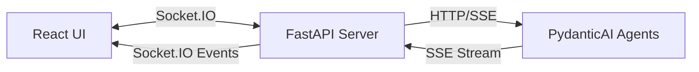

import Tabs from '@theme/Tabs';
import TabItem from '@theme/TabItem';
import Admonition from '@theme/Admonition';

# Agent Chat Panel

## Overview

The Agent Chat Panel provides a real-time interface for interacting with AI agents. It uses Socket.IO for reliable bidirectional communication and supports streaming responses from agents.

<Admonition type="success" title="Key Features">
- **Real-time streaming**: See agent responses as they're generated
- **Socket.IO reliability**: Automatic reconnection and state management
- **Multiple agent types**: Support for RAG, Document, and Task agents
- **Session persistence**: Chat history maintained across connections
- **Simple architecture**: Socket.IO ↔ Server ↔ SSE ↔ Agents
</Admonition>

## Architecture



### Communication Flow

1. **UI to Server**: Socket.IO events and REST endpoints
2. **Server to Agents**: HTTP requests with SSE streaming responses
3. **Agents to Server**: Server-Sent Events (SSE) for streaming
4. **Server to UI**: Socket.IO events for real-time updates

## Frontend Usage

<Tabs>
<TabItem value="component" label="React Component">

```tsx
import { ArchonChatPanel } from '@/components/layouts/ArchonChatPanel';

function App() {
  return (
    <div className="flex h-screen">
      {/* Your main content */}
      <div className="flex-1">
        {/* ... */}
      </div>
      
      {/* Chat Panel */}
      <ArchonChatPanel />
    </div>
  );
}
```

</TabItem>
<TabItem value="service" label="Service Usage">

```typescript
import { agentChatService } from '@/services/agentChatService';

// Create a chat session
const { session_id } = await agentChatService.createSession(
  undefined,  // project_id (optional)
  'rag'       // agent_type: 'rag' | 'document' | 'task'
);

// Connect WebSocket for real-time updates
await agentChatService.connectWebSocket(
  session_id,
  (message) => {
    // Handle incoming messages
    console.log('Agent:', message.content);
  },
  (isTyping) => {
    // Handle typing indicator
    console.log('Agent is typing:', isTyping);
  },
  (chunk) => {
    // Handle streaming chunks
    console.log('Chunk:', chunk);
  },
  () => {
    // Handle stream completion
    console.log('Stream complete');
  }
);

// Send a message
await agentChatService.sendMessage(
  session_id,
  'What is Archon?',
  { match_count: 5 }  // Optional context
);
```

</TabItem>
</Tabs>

## Backend Implementation

### Socket.IO Events

The chat system uses Socket.IO events with room-based isolation:

<Tabs>
<TabItem value="events" label="Event Handlers">

```python
from ..socketio_app import get_socketio_instance
sio = get_socketio_instance()

@sio.event
async def join_chat(sid, data):
    """Join a chat room."""
    session_id = data.get('session_id')
    await sio.enter_room(sid, f'chat_{session_id}')

@sio.event
async def chat_message(sid, data):
    """Handle incoming chat messages."""
    session_id = data.get('session_id')
    message = data.get('message')
    context = data.get('context', {})
    
    # Process with agent
    await process_agent_response(session_id, message, context)
```

</TabItem>
<TabItem value="streaming" label="SSE Proxy">

```python
async def process_agent_response(session_id: str, message: str, context: dict):
    """Stream agent response via SSE and emit to Socket.IO."""
    room = f'chat_{session_id}'
    
    # Call agents service with SSE streaming
    async with httpx.AsyncClient() as client:
        async with client.stream(
            "POST",
            f"http://archon-agents:8052/agents/rag/stream",
            json={
                "prompt": message,
                "context": context
            }
        ) as response:
            # Stream SSE chunks to Socket.IO
            async for line in response.aiter_lines():
                if line.startswith("data: "):
                    chunk_data = json.loads(line[6:])
                    
                    # Emit streaming chunk
                    await sio.emit('stream_chunk', {
                        "type": "stream_chunk",
                        "content": chunk_data.get('content', '')
                    }, room=room)
```

</TabItem>
</Tabs>

### REST Endpoints

Minimal REST endpoints for session management:

| Endpoint | Method | Purpose |
|----------|--------|---------|
| `/api/agent-chat/sessions` | POST | Create chat session |
| `/api/agent-chat/sessions/{id}` | GET | Get session info |
| `/api/agent-chat/sessions/{id}/messages` | POST | Send message (triggers Socket.IO) |

## Agent Types

### RAG Agent
- **Purpose**: Knowledge base Q&A with context retrieval
- **Context**: `{ match_count: 5, source_filter: "docs.archon.com" }`
- **Best for**: Documentation queries, technical questions

### Document Agent
- **Purpose**: Document analysis and content generation
- **Context**: `{ format: "markdown", style: "technical" }`
- **Best for**: Creating documentation, analyzing documents

### Task Agent
- **Purpose**: Task decomposition and project planning
- **Context**: `{ project_id: "uuid", detail_level: "high" }`
- **Best for**: Breaking down features, planning implementation

## Socket.IO Message Types

### Client to Server

| Event | Purpose | Data |
|-------|---------|------|
| `join_chat` | Join chat room | `{session_id: string}` |
| `chat_message` | Send message | `{session_id, message, context}` |
| `leave_chat` | Leave room | `{session_id: string}` |

### Server to Client

| Event | Purpose | Data |
|-------|---------|------|
| `connection_confirmed` | Confirm connection | `{session_id: string}` |
| `message` | Complete message | `{type: "message", data: ChatMessage}` |
| `stream_chunk` | Streaming chunk | `{type: "stream_chunk", content: string}` |
| `stream_complete` | Stream finished | `{type: "stream_complete"}` |
| `typing` | Typing indicator | `{type: "typing", is_typing: boolean}` |
| `error` | Error occurred | `{type: "error", error: string}` |

## Error Handling

<Admonition type="warning" title="Connection Management">
The chat service handles various connection scenarios:

- **Automatic reconnection**: Socket.IO reconnects with exponential backoff
- **Session recovery**: Creates new session if old one is invalid
- **Error propagation**: Errors from agents are forwarded to UI
- **Graceful degradation**: Shows offline state when server unavailable
</Admonition>

### Common Error Scenarios

1. **Agent Service Unavailable**
   ```json
   {
     "type": "error",
     "error": "Agent service error: 503"
   }
   ```

2. **Invalid Session**
   - Automatically creates new session
   - Transfers handlers to new session
   - Notifies UI of session change

3. **Network Disconnection**
   - Socket.IO handles reconnection
   - UI shows "connecting" state
   - Messages queued until reconnected

## Best Practices

<Tabs>
<TabItem value="frontend" label="Frontend">

1. **Handle connection states**
   ```typescript
   agentChatService.onStatusChange(sessionId, (status) => {
     switch(status) {
       case 'online': showOnlineIndicator(); break;
       case 'offline': showOfflineMessage(); break;
       case 'connecting': showLoadingSpinner(); break;
     }
   });
   ```

2. **Clean up on unmount**
   ```typescript
   useEffect(() => {
     return () => {
       agentChatService.disconnectWebSocket(sessionId);
       agentChatService.offStatusChange(sessionId);
     };
   }, [sessionId]);
   ```

3. **Handle streaming properly**
   ```typescript
   let accumulatedContent = '';
   
   const onStreamChunk = (chunk: string) => {
     accumulatedContent += chunk;
     updateDisplay(accumulatedContent);
   };
   ```

</TabItem>
<TabItem value="backend" label="Backend">

1. **Use rooms for isolation**
   ```python
   # Always use room pattern
   room = f'chat_{session_id}'
   await sio.emit('message', data, room=room)
   ```

2. **Handle SSE errors gracefully**
   ```python
   try:
     async for line in response.aiter_lines():
       # Process line
   except httpx.ReadTimeout:
     await sio.emit('error', {
       'error': 'Agent response timeout'
     }, room=room)
   ```

3. **Clean up sessions periodically**
   ```python
   # Remove old sessions after 24 hours
   for session_id, session in list(sessions.items()):
     if is_expired(session['created_at']):
       sessions.pop(session_id, None)
   ```

</TabItem>
</Tabs>

## Configuration

### Environment Variables

```bash
# Agent service configuration
AGENT_SERVICE_URL=http://archon-agents:8052

# Socket.IO configuration
SOCKETIO_PING_TIMEOUT=60
SOCKETIO_PING_INTERVAL=25

# Session configuration
SESSION_TTL_HOURS=24
MAX_MESSAGES_PER_SESSION=1000
```

### Frontend Configuration

```typescript
// Adjust WebSocket settings
const wsConfig = {
  maxReconnectAttempts: 5,
  reconnectInterval: 1000,
  heartbeatInterval: 30000,
  enableAutoReconnect: true,
  enableHeartbeat: true,
};
```

## Testing

### Manual Testing
1. Open the UI and verify chat panel appears
2. Check connection status indicator
3. Send a test message
4. Verify streaming response appears
5. Test reconnection by restarting server

### Integration Testing
```python
# Test Socket.IO events
async def test_chat_flow():
    # Create session
    response = await client.post("/api/agent-chat/sessions")
    session_id = response.json()["session_id"]
    
    # Connect Socket.IO
    sio_client = socketio.AsyncClient()
    await sio_client.connect("http://localhost:8080")
    
    # Join room
    await sio_client.emit("join_chat", {"session_id": session_id})
    
    # Send message
    await sio_client.emit("chat_message", {
        "session_id": session_id,
        "message": "Hello",
        "context": {}
    })
    
    # Verify response
    # ...
```

## Troubleshooting

<Admonition type="tip" title="Common Issues">

**Chat shows "offline"**
- Check if agents container is running: `docker ps | grep agents`
- Verify server logs: `docker logs archon-server`
- Check Socket.IO connection in browser DevTools

**Messages not streaming**
- Verify SSE endpoint is accessible
- Check agent logs for errors
- Ensure proper CORS configuration

**Session errors**
- Sessions are in-memory and lost on server restart
- Frontend will create new session automatically
- Check session_id in requests matches server state

</Admonition>

## Summary

The Agent Chat Panel provides a robust, real-time interface for AI agent interaction with:
- Socket.IO for reliable bidirectional communication
- SSE streaming for agent responses
- Simple session management
- Automatic error recovery
- Clean room-based isolation

Total implementation: ~250 lines of elegant, maintainable code.