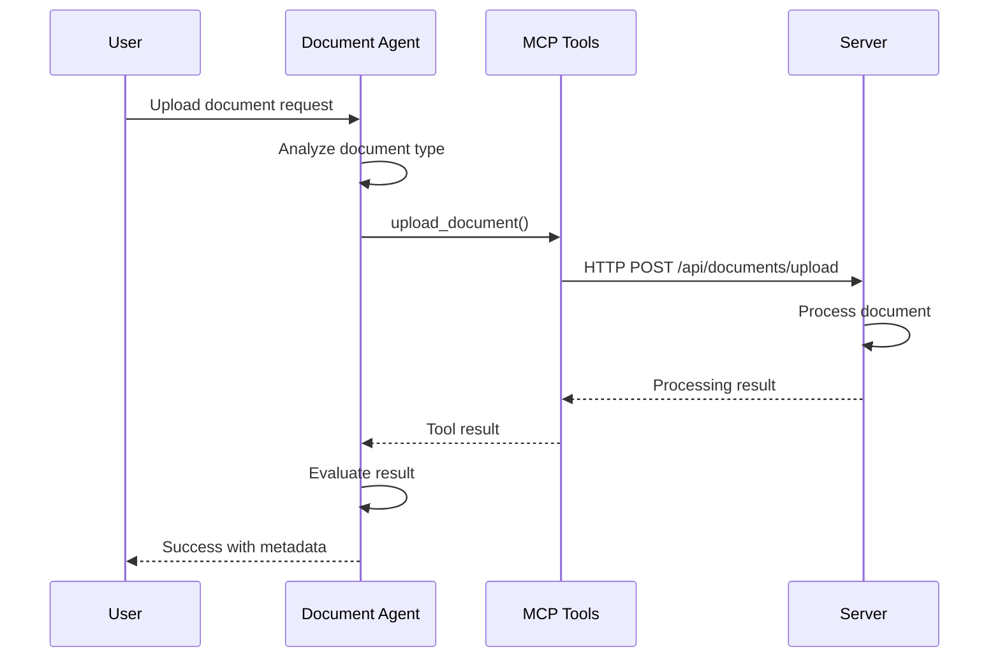
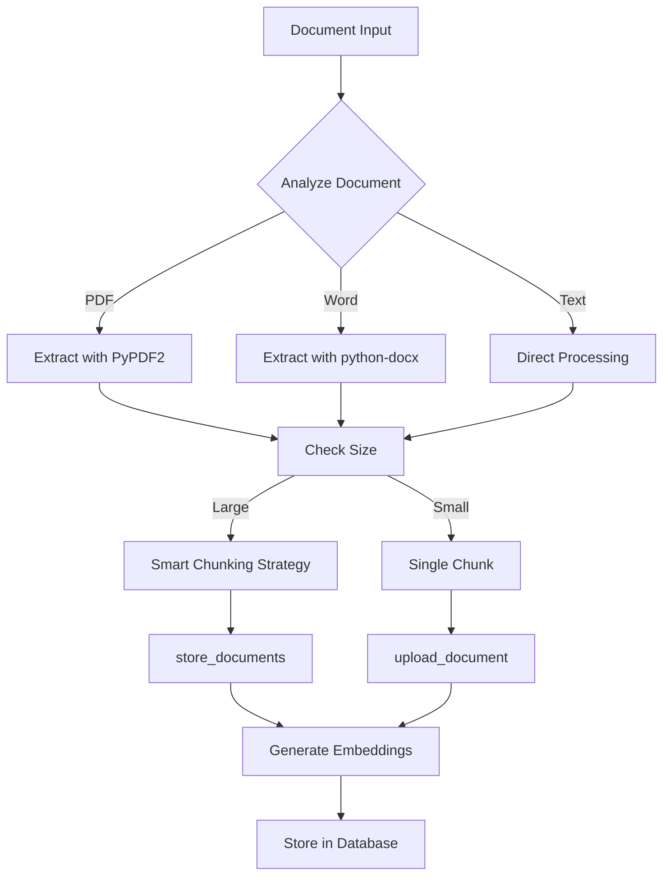

import Tabs from '@theme/Tabs';
import TabItem from '@theme/TabItem';
import Admonition from '@theme/Admonition';

# 📄 Document Agent

<div className="hero hero--secondary">
  <div className="container">
    <h2 className="hero__subtitle">
      **Intelligent document processing orchestration** using PydanticAI to coordinate document uploads, chunking, and organization through MCP tools.
    </h2>
  </div>
</div>

## 🎯 Overview

The Document Agent is a PydanticAI-powered orchestrator that handles complex document processing workflows. It analyzes documents, determines optimal processing strategies, and coordinates multiple MCP tools to achieve the best results.

<Admonition type="info" icon="💡" title="Pure Orchestration">
The Document Agent contains NO document processing logic. All actual processing is done by the Server service through MCP tool calls.
</Admonition>

## 🤖 Capabilities

### Document Analysis
- **Format Detection**: Identifies document type and structure
- **Content Analysis**: Determines optimal chunking strategy
- **Metadata Extraction**: Identifies key document properties
- **Processing Planning**: Creates multi-step processing workflows

### Orchestration Patterns
- **Single Document**: Upload and process individual files
- **Batch Processing**: Handle multiple documents efficiently
- **Conditional Workflows**: Different strategies based on content
- **Error Recovery**: Intelligent retry and fallback strategies

## 🔧 MCP Tools Used

| Tool | Purpose | When Used |
|------|---------|-----------|
| `upload_document` | Upload and process single documents | Individual file processing |
| `store_documents` | Store multiple document chunks | After chunking large documents |
| `manage_document` | CRUD operations on project documents | Project documentation management |
| `manage_versions` | Version control for documents | When updating existing documents |
| `crawl_single_page` | Process web pages as documents | When URL provided instead of file |

## 📊 Processing Workflows

### Standard Document Upload


### Complex Document Processing


## 💬 Example Interactions

### Simple Upload
```python
# User request
"Upload this technical specification document"

# Document Agent workflow
1. Analyze file: technical_spec.pdf
2. Detect: PDF format, 45 pages, technical content
3. Call: upload_document(
    file_path="technical_spec.pdf",
    doc_type="technical",
    chunk_size=5000
)
4. Monitor: Processing progress
5. Return: "Document uploaded successfully with 23 chunks created"
```

### Intelligent Processing
```python
# User request
"Process this large documentation folder"

# Document Agent workflow
1. Scan folder structure
2. Identify: 15 markdown files, 3 PDFs, 2 Word docs
3. Plan: Batch processing strategy
4. Execute:
   - Group markdown files for efficient processing
   - Handle PDFs individually due to size
   - Convert Word docs to markdown first
5. Coordinate: Multiple store_documents calls
6. Aggregate: Results from all operations
7. Return: "Processed 20 documents creating 145 searchable chunks"
```

## 🔍 Implementation Details

### Agent Structure
```python
from pydantic_ai import Agent, RunContext
from typing import List, Dict, Any

class DocumentAgent(Agent):
    """Orchestrates document processing operations"""
    
    name = "document_processor"
    description = "Handles document uploads and processing"
    
    tools = [
        "upload_document",
        "store_documents", 
        "manage_document",
        "manage_versions"
    ]
    
    async def process_request(
        self, 
        context: RunContext,
        request: str
    ) -> Dict[str, Any]:
        # Analyze request and determine strategy
        strategy = self.analyze_request(request)
        
        # Execute appropriate workflow
        if strategy.type == "single_upload":
            return await self.single_document_workflow(context, strategy)
        elif strategy.type == "batch_process":
            return await self.batch_workflow(context, strategy)
        # ... more strategies
```

### Decision Making
The Document Agent makes intelligent decisions about:
1. **Chunk Size**: Based on document type and content
2. **Processing Order**: Prioritizes based on dependencies
3. **Parallelization**: When to process in parallel vs sequential
4. **Error Handling**: Retry strategies for failed operations

## 📈 Performance Optimization

### Batching Strategy
- Groups similar documents for efficient processing
- Minimizes API calls by batching operations
- Balances batch size with memory constraints

### Caching Decisions
- Remembers processing strategies for similar documents
- Caches metadata extraction results
- Reuses successful workflow patterns

## 🚨 Error Handling

### Common Scenarios
1. **Large File Handling**
   - Automatically switches to streaming mode
   - Breaks into smaller chunks for processing

2. **Format Issues**
   - Falls back to text extraction
   - Attempts multiple parsing strategies

3. **Network Failures**
   - Implements exponential backoff
   - Saves progress for resume capability

### Error Recovery Example
```python
# Workflow with error handling
try:
    result = await upload_document(file_path)
except FileTooLargeError:
    # Switch to chunked upload
    chunks = await prepare_chunks(file_path)
    results = []
    for chunk in chunks:
        result = await store_documents([chunk])
        results.append(result)
    return aggregate_results(results)
```

## 🔗 Integration Examples

### With Project Management
```python
# Creating project documentation
"Create project documentation from these design files"

# Agent coordinates:
1. manage_project() - Create or find project
2. upload_document() - Process each design file
3. manage_document() - Link to project
4. manage_versions() - Set up version tracking
```

### With Knowledge Base
```python
# Building knowledge base
"Add all our API documentation to the knowledge base"

# Agent coordinates:
1. crawl_single_page() - For online docs
2. upload_document() - For local files
3. store_documents() - For processed content
4. Cross-reference with existing content
```

## 📊 Monitoring & Metrics

### Key Metrics Tracked
- **Processing Time**: Per document and total
- **Chunk Count**: Documents to chunks ratio
- **Success Rate**: Successful vs failed uploads
- **Tool Usage**: Which MCP tools used most

### Processing Traces
The Document Agent provides detailed processing traces showing document type, file size, and processing strategy for each operation.

## 🔗 Related Documentation

- [Agents Overview](./agents-overview) - Understanding the Agents service
- [Upload Document Tool](./mcp-tools#upload-document) - MCP tool details
- [Document Service](./server-services#document-service) - Backend implementation
- [Document Storage API](./api-reference#document-management-api) - REST endpoints