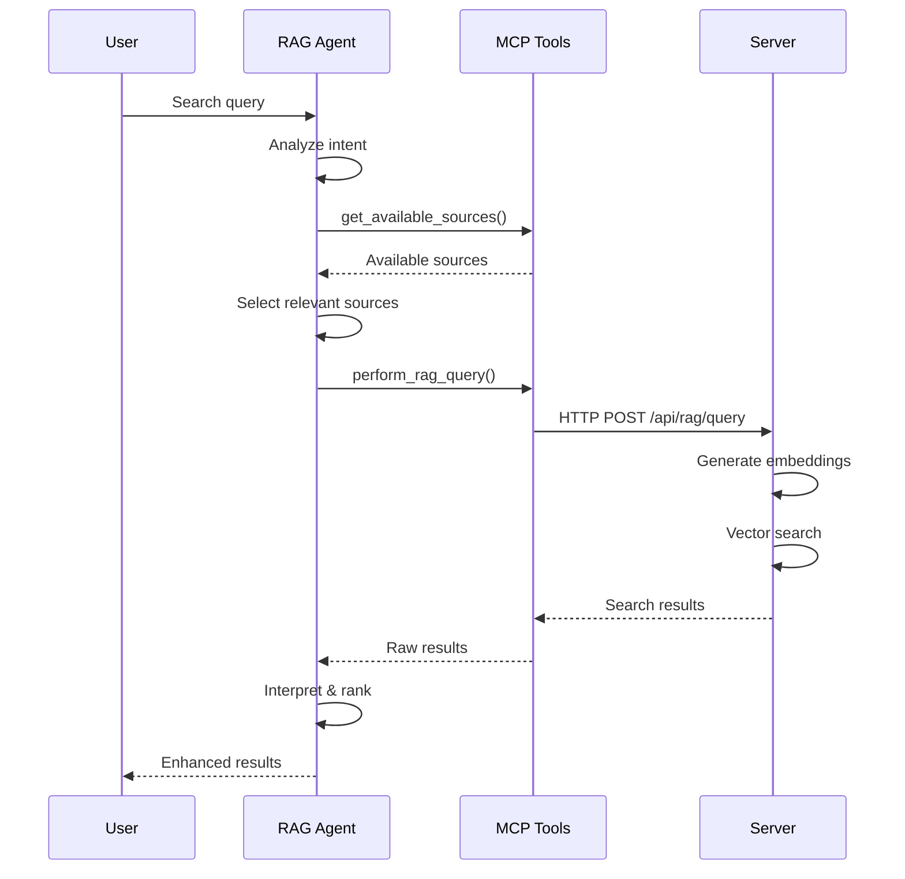
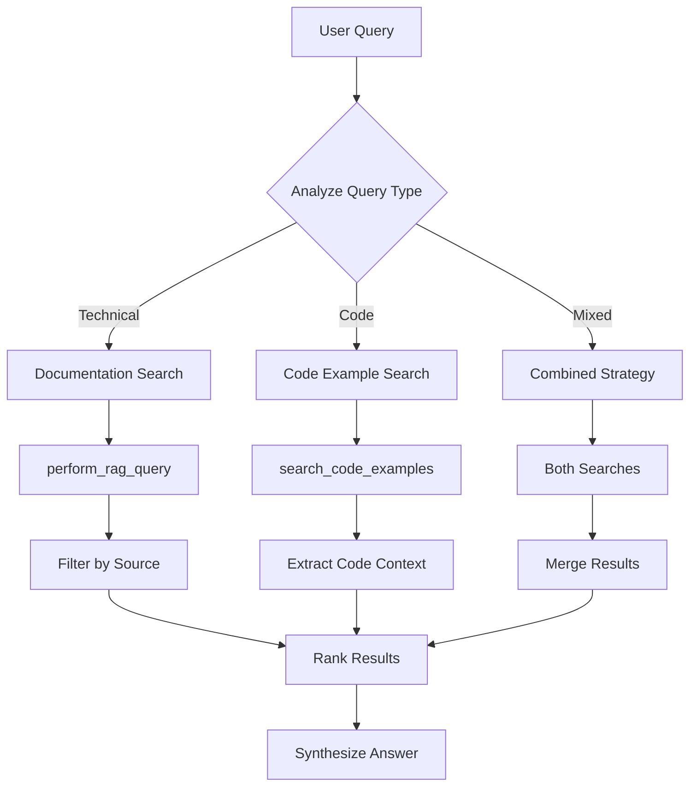

import Tabs from '@theme/Tabs';
import TabItem from '@theme/TabItem';
import Admonition from '@theme/Admonition';

# 🧠 RAG Agent

<div className="hero hero--secondary">
  <div className="container">
    <h2 className="hero__subtitle">
      **Intelligent search orchestration** using PydanticAI to enhance queries, coordinate searches, and interpret results through MCP tools.
    </h2>
  </div>
</div>

## 🎯 Overview

The RAG (Retrieval-Augmented Generation) Agent is a PydanticAI-powered orchestrator that enhances search capabilities by intelligently refining queries, coordinating multiple search strategies, and interpreting results for optimal relevance.

<Admonition type="info" icon="💡" title="Pure Orchestration">
The RAG Agent contains NO embedding models or search logic. All actual search operations are performed by the Server service through MCP tool calls.
</Admonition>

## 🤖 Capabilities

### Query Enhancement
- **Intent Analysis**: Understands what the user is really looking for
- **Query Expansion**: Adds synonyms and related terms
- **Context Awareness**: Uses conversation history for better results
- **Multi-Query Strategy**: Breaks complex queries into sub-queries

### Search Orchestration
- **Source Selection**: Chooses optimal sources to search
- **Result Aggregation**: Combines results from multiple searches
- **Relevance Filtering**: Removes low-quality matches
- **Answer Synthesis**: Creates coherent responses from fragments

## 🔧 MCP Tools Used

| Tool | Purpose | When Used |
|------|---------|-----------|
| `perform_rag_query` | Main semantic search | Primary search operations |
| `search_code_examples` | Code-specific search | When looking for code |
| `get_available_sources` | List searchable sources | To filter searches |
| `crawl_single_page` | Add new content | When current knowledge insufficient |
| `smart_crawl_url` | Crawl documentation sites | For comprehensive updates |

## 📊 Search Workflows

### Standard RAG Query


### Multi-Strategy Search


## 💬 Example Interactions

### Simple Search
```python
# User request
"How do I implement authentication in React?"

# RAG Agent workflow
1. Analyze: Technical query about React authentication
2. Check sources: Find React documentation available
3. Enhance query: Add terms like "login", "JWT", "auth context"
4. Call: perform_rag_query(
    query="React authentication implementation login JWT",
    source="react-docs",
    match_count=10
)
5. Filter: Remove generic authentication results
6. Return: Focused results with code examples
```

### Complex Multi-Source Search
```python
# User request
"Compare different state management solutions for React"

# RAG Agent workflow
1. Identify: Comparison query requiring multiple sources
2. Break down: 
   - "Redux state management"
   - "MobX state management"
   - "Zustand state management"
   - "React Context API"
3. Execute parallel searches:
   - perform_rag_query(query="Redux", source="redux-docs")
   - perform_rag_query(query="MobX", source="mobx-docs")
   - search_code_examples(query="state management comparison")
4. Aggregate: Combine results from all queries
5. Synthesize: Create comparison table
6. Return: Structured comparison with pros/cons
```

## 🔍 Implementation Details

### Agent Structure
```python
from pydantic_ai import Agent, RunContext
from typing import List, Dict, Any

class RAGAgent(Agent):
    """Orchestrates RAG search operations"""
    
    name = "rag_search"
    description = "Enhances search queries and interprets results"
    
    tools = [
        "perform_rag_query",
        "search_code_examples",
        "get_available_sources",
        "crawl_single_page"
    ]
    
    async def search(
        self,
        context: RunContext,
        query: str
    ) -> Dict[str, Any]:
        # Analyze query intent
        intent = self.analyze_intent(query)
        
        # Get available sources
        sources = await context.tools.get_available_sources()
        
        # Plan search strategy
        strategy = self.plan_strategy(intent, sources)
        
        # Execute searches
        results = await self.execute_strategy(context, strategy)
        
        # Synthesize response
        return self.synthesize_answer(results)
```

### Query Enhancement Strategies

#### Synonym Expansion
```python
# Original query
"fix bug in authentication"

# Enhanced query
"fix bug error issue problem authentication login auth JWT session"
```

#### Contextual Enhancement
```python
# With context of previous React questions
"how to test it"

# Enhanced with context
"React authentication testing unit test integration test Jest React Testing Library"
```

#### Technical Term Addition
```python
# User query
"make it faster"

# Enhanced for technical search
"performance optimization speed improve fast efficient caching memoization"
```

## 📈 Search Optimization

### Result Ranking Factors
1. **Semantic Similarity**: How closely content matches query
2. **Source Reliability**: Prefer official documentation
3. **Recency**: Newer content scored higher
4. **Code Presence**: Boost results with examples
5. **Context Relevance**: Match to conversation history

### Caching Strategy
- Cache frequent queries for instant results
- Store query enhancement patterns
- Remember successful search strategies
- Cache source metadata for filtering

## 🚨 Handling Edge Cases

### No Results Found
```python
# Strategy when no results
1. Broaden search terms
2. Remove source filters
3. Try alternative phrasings
4. Suggest crawling new content
5. Provide helpful error message

# Example
if not results:
    # Try broader search
    results = await perform_rag_query(
        query=simplified_query,
        source=None,  # Search all sources
        match_count=20  # Get more results
    )
    
    if still not results:
        # Suggest adding content
        return {
            "message": "No results found. Would you like me to crawl relevant documentation?",
            "suggestion": f"crawl_single_page('{suggested_url}')"
        }
```

### Ambiguous Queries
```python
# Handle unclear intent
"How do I fix this?"

# Agent response
1. Analyze context for clues
2. Ask clarifying questions
3. Provide multiple interpretations
4. Show results for each interpretation
```

## 🔗 Integration Patterns

### With Document Processing
```python
# Enhancing knowledge base
"This documentation is missing, add it"

# Agent coordinates:
1. Identify missing content area
2. Find relevant documentation URL
3. crawl_single_page() or smart_crawl_url()
4. Verify content was added
5. Test with sample query
```

### With Task Management
```python
# Finding task-related information
"What tasks are related to authentication?"

# Agent coordinates:
1. search_code_examples(query="authentication")
2. Extract file paths and functions
3. Cross-reference with task descriptions
4. Return relevant tasks with context
```

## 📊 Performance Metrics

### Key Metrics
- **Query Enhancement Rate**: How often queries are modified
- **Result Relevance**: User satisfaction with results
- **Search Latency**: Time from query to results
- **Cache Hit Rate**: Percentage served from cache

### Search Monitoring
The RAG Agent automatically tracks search performance including original query, enhanced query, and sources searched for each operation.

## 🎯 Best Practices

### Query Optimization
1. **Be Specific**: Add technical context when possible
2. **Use Examples**: "like X but for Y" helps
3. **Specify Sources**: Filter when you know the source
4. **Iterate**: Refine based on initial results

### Result Interpretation
1. **Check Scores**: Higher similarity scores = better matches
2. **Verify Sources**: Official docs > community content
3. **Look for Code**: Examples often clarify concepts
4. **Read Context**: Surrounding text provides clarity

## 🔗 Related Documentation

- [Agents Overview](./agents-overview) - Understanding the Agents service
- [RAG Query Tool](./mcp-tools#perform-rag-query) - MCP tool details
- [Search Service](./server-services#search-service) - Backend implementation
- [Knowledge Overview](./knowledge-overview) - Knowledge base features