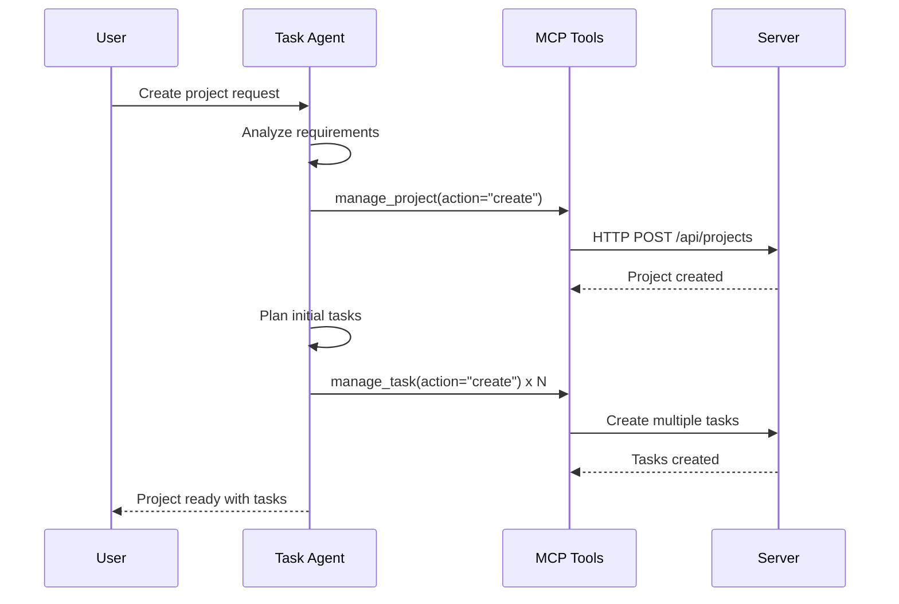
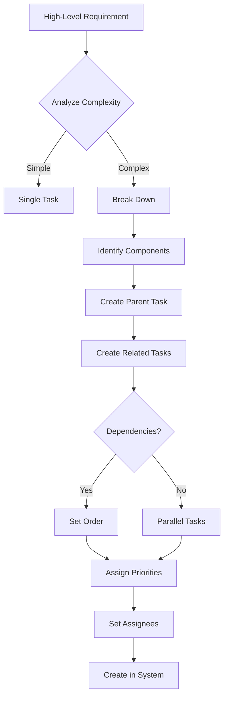

import Tabs from '@theme/Tabs';
import TabItem from '@theme/TabItem';
import Admonition from '@theme/Admonition';

# 📋 Task Agent

<div className="hero hero--secondary">
  <div className="container">
    <h2 className="hero__subtitle">
      **Intelligent task orchestration** using PydanticAI to break down complex work, manage dependencies, and coordinate project workflows through MCP tools.
    </h2>
  </div>
</div>

## 🎯 Overview

The Task Agent is a PydanticAI-powered orchestrator that handles complex project and task management workflows. It can break down high-level requirements into actionable tasks, manage dependencies, and coordinate multiple operations to keep projects organized.

<Admonition type="info" icon="💡" title="Pure Orchestration">
The Task Agent contains NO project management logic. All actual operations are performed by the Server service through MCP tool calls.
</Admonition>

## 🤖 Capabilities

### Task Analysis
- **Requirement Breakdown**: Converts high-level goals into specific tasks
- **Dependency Detection**: Identifies task relationships
- **Priority Assignment**: Determines task importance
- **Effort Estimation**: Suggests task complexity

### Project Orchestration
- **Project Creation**: Sets up new projects with structure
- **Task Organization**: Creates and manages related tasks
- **Status Management**: Coordinates task state transitions
- **Team Coordination**: Assigns work to humans or AI agents

## 🔧 MCP Tools Used

| Tool | Purpose | When Used |
|------|---------|-----------|
| `manage_project` | Project CRUD operations | Project creation/updates |
| `manage_task` | Task lifecycle management | All task operations |
| `manage_document` | Project documentation | PRDs, specs, notes |
| `manage_versions` | Version control | Document updates |
| `get_project_features` | Feature retrieval | Planning workflows |

## 📊 Task Workflows

### Project Setup


### Task Breakdown


## 💬 Example Interactions

### Project Creation
```python
# User request
"Create a project for building a user authentication system"

# Task Agent workflow
1. Create project:
   manage_project(
       action="create",
       title="User Authentication System",
       github_repo="https://github.com/team/auth-system"
   )

2. Generate initial tasks:
   - Design authentication flow
   - Implement user model
   - Create login API endpoint
   - Build registration flow
   - Add password reset
   - Write tests
   - Create documentation

3. Create each task with relationships:
   for task in generated_tasks:
       manage_task(
           action="create",
           project_id=project.id,
           title=task.title,
           description=task.description,
           assignee=task.suggested_assignee
       )

4. Return: "Created project with 7 initial tasks"
```

### Complex Task Breakdown
```python
# User request
"Break down 'Implement login API endpoint' into smaller tasks"

# Task Agent workflow
1. Analyze the main task
2. Identify components:
   - Input validation
   - Database query
   - Password verification
   - JWT generation
   - Response formatting
   - Error handling

3. Create related tasks:
   manage_task(action="create", project_id=project_id, ...)
   
4. Set logical order and priorities:
   - Input validation (priority: high)
   - Database query (priority: high)
   - Password verification (priority: high)
   - JWT generation (priority: medium)

5. Return: "Created 6 related tasks with appropriate priorities"
```

## 🔍 Implementation Details

### Agent Structure
```python
from pydantic_ai import Agent, RunContext
from typing import List, Dict, Any

class TaskAgent(Agent):
    """Orchestrates task and project management"""
    
    name = "task_manager"
    description = "Manages projects and tasks intelligently"
    
    tools = [
        "manage_project",
        "manage_task",
        "manage_document",
        "manage_versions",
        "get_project_features"
    ]
    
    async def process_request(
        self,
        context: RunContext,
        request: str
    ) -> Dict[str, Any]:
        # Understand the request
        intent = self.analyze_intent(request)
        
        # Execute appropriate workflow
        if intent.type == "create_project":
            return await self.create_project_workflow(context, intent)
        elif intent.type == "break_down_task":
            return await self.breakdown_workflow(context, intent)
        elif intent.type == "update_status":
            return await self.status_workflow(context, intent)
        # ... more workflows
```

### Intelligence Patterns

#### Task Generation
```python
def generate_tasks_for_feature(feature_description: str) -> List[Task]:
    """Generate tasks based on feature requirements"""
    
    # Analyze feature type
    if "authentication" in feature_description:
        return [
            Task("Design auth flow", "User", "high"),
            Task("Implement auth service", "AI IDE Agent", "high"),
            Task("Create login UI", "User", "medium"),
            Task("Add tests", "AI IDE Agent", "high"),
            Task("Document API", "Archon", "medium")
        ]
    # ... more patterns
```

#### Dependency Detection
```python
def detect_dependencies(tasks: List[Task]) -> List[Dependency]:
    """Identify task relationships"""
    
    dependencies = []
    for task in tasks:
        if "test" in task.title.lower():
            # Tests depend on implementation
            impl_task = find_implementation_task(tasks, task)
            if impl_task:
                dependencies.append(Dependency(impl_task, task))
    
    return dependencies
```

## 📈 Project Management Patterns

### Sprint Planning
```python
# Organize tasks into sprints
"Plan the next sprint"

# Agent workflow:
1. Get all pending tasks
2. Analyze task priorities and sizes
3. Group related tasks
4. Balance workload
5. Create sprint documentation
6. Update task assignments
```

### Progress Tracking
```python
# Monitor project progress
"Show me what's blocking progress"

# Agent workflow:
1. Find all "blocked" status tasks
2. Analyze blocking reasons
3. Identify dependency chains
4. Suggest solutions
5. Return actionable report
```

## 🚨 Advanced Orchestration

### Multi-Project Coordination
```python
# Handle cross-project dependencies
"The auth system needs the user service completed first"

# Agent coordinates:
1. Identify both projects
2. Find related tasks
3. Create cross-project dependency
4. Adjust timelines
5. Notify relevant assignees
```

### Automated Status Updates
```python
# Intelligent status management
"Update all completed development tasks to review"

# Agent workflow:
1. Find tasks with:
   - Status: "doing"
   - Assignee: "AI IDE Agent"
   - Recent activity
2. Check completion criteria
3. Update status to "review"
4. Notify reviewers
```

## 🔗 Integration Examples

### With Knowledge Base
```python
# Link tasks to documentation
"Find all tasks related to React hooks"

# Agent coordinates:
1. perform_rag_query("React hooks")
2. Extract relevant file paths
3. Search tasks mentioning those files
4. Create task-knowledge links
5. Return related tasks
```

### With Document Management
```python
# Create project documentation
"Generate PRD for the authentication project"

# Agent coordinates:
1. get_project_features(project_id)
2. Analyze existing tasks
3. Generate PRD structure
4. manage_document(action="add", content=prd)
5. Link to project
```

## 📊 Performance Metrics

### Key Metrics
- **Task Creation Time**: Speed of generating tasks
- **Breakdown Accuracy**: Quality of task decomposition
- **Dependency Detection**: Correctly identified relationships
- **Assignment Distribution**: Balance across team

### Performance Tracking
The Task Agent automatically tracks operation performance and provides detailed results for each orchestration workflow.

## 🎯 Best Practices

### Task Creation
1. **Clear Titles**: Actionable and specific
2. **Descriptions**: Include acceptance criteria
3. **Right-Sizing**: Not too big, not too small
4. **Assignments**: Match skills to assignees

### Project Organization
1. **Feature Grouping**: Related tasks together
2. **Milestone Planning**: Clear project phases
3. **Documentation**: Keep PRDs updated
4. **Regular Reviews**: Adjust as needed

## 🔗 Related Documentation

- [Agents Overview](./agents-overview) - Understanding the Agents service
- [Project Management Tools](./mcp-tools#project-tools) - MCP tool details
- [Task Service](./server-services#task-service) - Backend implementation
- [Projects Overview](./projects-overview) - Project management features