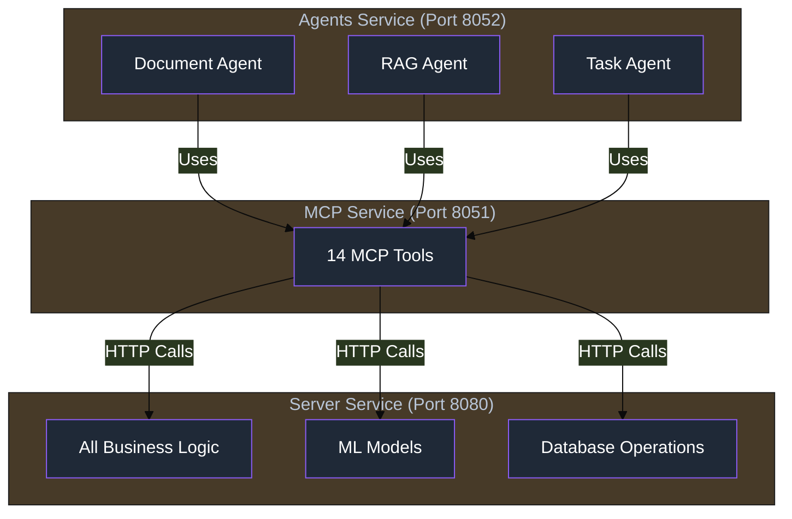

import Tabs from '@theme/Tabs';
import TabItem from '@theme/TabItem';
import Admonition from '@theme/Admonition';

# ⚙️ Agents Service Overview

<div className="hero hero--primary">
  <div className="container">
    <h2 className="hero__subtitle">
      **PydanticAI-powered agents** that orchestrate complex operations by intelligently combining MCP tools. No business logic, pure AI orchestration.
    </h2>
  </div>
</div>

<Admonition type="warning" icon="⚠️" title="Critical Architecture Principle">

**The Agents service is purely an AI orchestration layer that:**
- Contains PydanticAI agent implementations
- Uses MCP tools for ALL operations
- Has NO direct database access
- Contains NO ML models or embeddings
- Performs NO data processing

**All actual functionality comes from calling MCP tools, which in turn call the Server service.**

</Admonition>

## 🏗️ Architecture Overview

The Agents Service (`archon-agents`) runs on port 8052 and contains three specialized PydanticAI agents:



## 🤖 Available Agents

### 1. Document Agent
- **Purpose**: Orchestrates document processing workflows
- **Capabilities**: Intelligent document handling and organization
- **MCP Tools Used**: `upload_document`, `manage_document`, `store_documents`

### 2. RAG Agent
- **Purpose**: Orchestrates knowledge retrieval and search refinement
- **Capabilities**: Query enhancement and result interpretation
- **MCP Tools Used**: `perform_rag_query`, `search_code_examples`, `get_available_sources`

### 3. Task Agent
- **Purpose**: Orchestrates project and task management workflows
- **Capabilities**: Task breakdown and status management
- **MCP Tools Used**: `manage_project`, `manage_task`, `manage_versions`

## 🎯 How Agents Work

### PydanticAI Framework
All agents are built using the PydanticAI framework, which provides:
- Type-safe agent definitions
- Structured tool calling
- Context management
- Error handling

### Agent Workflow Pattern
```python
# Conceptual flow (simplified)
class DocumentAgent:
    async def process_document(self, file_path: str, doc_type: str):
        # 1. Analyze document requirements
        analysis = self.analyze_document_type(file_path)
        
        # 2. Call MCP tool to upload
        result = await mcp_tools.upload_document(
            file_path=file_path,
            doc_type=doc_type,
            metadata=analysis.metadata
        )
        
        # 3. Orchestrate additional processing
        if analysis.needs_chunking:
            await mcp_tools.store_documents(...)
        
        # 4. Return structured result
        return ProcessingResult(...)
```

## 🔧 Technical Implementation

### Service Configuration
- **Framework**: FastAPI for the HTTP server
- **Port**: 8052
- **Dependencies**: PydanticAI, MCP client libraries
- **No Database**: All data operations via MCP tools

### Communication Flow
1. **External Request** → Agents Service
2. **Agent Analysis** → Determines required operations
3. **MCP Tool Calls** → Multiple coordinated tool calls
4. **Server Processing** → Actual work done in Server service
5. **Result Aggregation** → Agent combines results
6. **Response** → Structured output to caller

### Health Check
```bash
curl http://localhost:8052/health

# Response
{
  "status": "healthy",
  "service": "archon-agents",
  "agents_available": ["document", "rag", "task"],
  "mcp_connection": "active"
}
```

## 🚀 Docker Deployment

```dockerfile
# Agents Service Dockerfile
FROM python:3.12-slim

WORKDIR /app

# Install dependencies
COPY requirements.txt .
RUN pip install -r requirements.txt

# Copy agent implementations
COPY src/agents/ src/agents/

# Environment variables
ENV PYTHONPATH=/app/src
ENV MCP_SERVER_URL=http://archon-mcp:8051

# Run the service
CMD ["uvicorn", "src.agents.server:app", "--host", "0.0.0.0", "--port", "8052"]
```

## 📊 Monitoring

### Logfire Integration
All agent operations are monitored with Logfire:
- Agent invocation tracking
- MCP tool call monitoring
- Performance metrics
- Error tracking

### Key Metrics
- **Agent Response Time**: Time to complete orchestration
- **Tool Call Count**: Number of MCP tools used per request
- **Success Rate**: Percentage of successful operations
- **Error Types**: Common failure patterns

## 🔗 Integration Points

### API Endpoints
The Agents service is called by the Server service for complex operations:
- `POST /api/agent-chat/message` - Main chat interface
- `POST /agents/document/process` - Document processing
- `POST /agents/rag/search` - Enhanced search
- `POST /agents/task/manage` - Task orchestration

### MCP Tool Usage
Agents can use all 14 MCP tools:
- 7 Knowledge Management tools
- 5 Project Management tools
- 2 System tools

## 🎯 When to Use Agents

### Use Agents When:
- Complex orchestration is needed
- Multiple MCP tools must be coordinated
- Intelligent decision-making is required
- Natural language processing helps

### Direct MCP Tools When:
- Simple, single operations
- Performance is critical
- Deterministic behavior needed
- No orchestration required

## 🔗 Related Documentation

- [Agent Chat Panel](./agent-chat) - Real-time UI for interacting with agents
- [Document Agent](./agent-document) - Document processing orchestration
- [RAG Agent](./agent-rag) - Search and retrieval orchestration
- [Task Agent](./agent-task) - Project management orchestration
- [MCP Tools Reference](./mcp-tools) - Available MCP tools
- [Server Architecture](./server-overview) - Overall system design