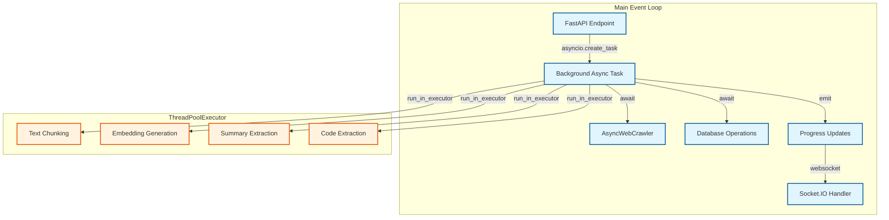

# Background Tasks Architecture

## Overview

This document describes the architecture for handling long-running operations in Archon without blocking the FastAPI/Socket.IO event loop. The key insight is that browser-based operations (crawling) must remain in the main event loop, while only CPU-intensive operations should be offloaded to threads.

## Architecture Principles

1. **Keep async I/O operations in the main event loop** - Browser automation, database operations, and network requests must stay async
2. **Only offload CPU-intensive work to threads** - Text processing, chunking, and synchronous API calls can run in ThreadPoolExecutor
3. **Use asyncio.create_task for background async work** - Don't block the event loop, but keep async operations async
4. **Maintain single event loop** - Never create new event loops in threads

## Architecture Diagram



## Core Components

### CrawlOrchestrationService

The orchestration service manages the entire crawl workflow while keeping the main event loop responsive:

```python
class CrawlOrchestrationService:
    def __init__(self, crawler, supabase_client, progress_id=None):
        self.crawler = crawler
        self.supabase_client = supabase_client
        self.progress_id = progress_id
        self.active_tasks = {}
        # Thread pool for CPU-intensive operations only
        self.executor = ThreadPoolExecutor(max_workers=4)
    
    async def orchestrate_crawl(self, request: Dict[str, Any]) -> Dict[str, Any]:
        """Start crawl operation as background task"""
        url = str(request.get('url', ''))
        
        # Create background task in the SAME event loop
        task = asyncio.create_task(
            self._async_orchestrate_crawl(request)
        )
        
        # Store task reference
        self.active_tasks[self.progress_id] = task
        
        # Return immediately
        return {
            "task_id": self.progress_id,
            "status": "started",
            "message": f"Crawl operation started for {url}"
        }
    
    async def _async_orchestrate_crawl(self, request: Dict[str, Any]):
        """Background async task - runs in main event loop"""
        try:
            url = request.get('url', '')
            
            # Emit initial progress
            await self._emit_progress({
                'status': 'analyzing',
                'percentage': 0,
                'currentUrl': url,
                'log': f'Analyzing URL type for {url}'
            })
            
            # Step 1: Crawl URLs (MUST stay async in main loop)
            crawl_results = await self._crawl_urls_async(url, request)
            
            # Step 2: Process documents (CPU-intensive, can go to thread)
            loop = asyncio.get_event_loop()
            doc_results = await loop.run_in_executor(
                self.executor,
                self._process_documents_sync,  # Sync version
                crawl_results, request
            )
            
            # Step 3: Store in database (MUST stay async in main loop)
            await self._store_documents_async(doc_results)
            
            # Step 4: Generate embeddings (CPU-intensive, can go to thread)
            await loop.run_in_executor(
                self.executor,
                self._generate_embeddings_sync,
                doc_results
            )
            
            # Step 5: Extract code (CPU-intensive, can go to thread)
            code_count = await loop.run_in_executor(
                self.executor,
                self._extract_code_sync,
                crawl_results
            )
            
            # Complete
            await self._emit_progress({
                'status': 'complete',
                'percentage': 100,
                'log': 'Crawl operation completed successfully'
            })
            
        except Exception as e:
            logger.error(f"Crawl orchestration error: {e}")
            await self._emit_progress({
                'status': 'error',
                'percentage': -1,
                'error': str(e)
            })
    
    async def _emit_progress(self, update: Dict[str, Any]):
        """Emit progress via Socket.IO"""
        if self.progress_id:
            await update_crawl_progress(self.progress_id, update)
```

### Sync Functions for Thread Execution

Only CPU-intensive operations should have sync versions for thread execution:

```python
def _process_documents_sync(self, crawl_results, request):
    """Sync version for thread execution - CPU-intensive text processing"""
    all_chunks = []
    for doc in crawl_results:
        # Text chunking is CPU-intensive
        chunks = self.chunk_text(doc['markdown'])
        all_chunks.extend(chunks)
    return {
        'chunks': all_chunks,
        'chunk_count': len(all_chunks)
    }

def _generate_embeddings_sync(self, doc_results):
    """Sync version - uses synchronous OpenAI client"""
    client = openai.Client()  # Sync client
    embeddings = []
    
    for chunk in doc_results['chunks']:
        # CPU-intensive: preparing embedding request
        response = client.embeddings.create(
            input=chunk,
            model="text-embedding-3-small"
        )
        embeddings.append(response.data[0].embedding)
    
    return embeddings

def _extract_code_sync(self, crawl_results):
    """Sync version - CPU-intensive regex and parsing"""
    code_examples = []
    for doc in crawl_results:
        # Extract code blocks with regex
        code_blocks = self.extract_code_blocks(doc['markdown'])
        code_examples.extend(code_blocks)
    return len(code_examples)
```

### Socket.IO Integration

Socket.IO handlers remain in the main event loop:

```python
# socketio_handlers.py

async def update_crawl_progress(progress_id: str, data: dict):
    """Emit progress updates to connected clients"""
    # Check if room has subscribers
    room_sids = []
    if hasattr(sio.manager, 'rooms'):
        namespace_rooms = sio.manager.rooms.get('/', {})
        room_sids = list(namespace_rooms.get(progress_id, []))
    
    if not room_sids:
        logger.warning(f"No subscribers in room {progress_id}")
        return
    
    # Emit progress
    data['progressId'] = progress_id
    await sio.emit('crawl_progress', data, room=progress_id)

@sio.event
async def subscribe_to_progress(sid, data):
    """Client subscribes to progress updates"""
    progress_id = data.get('progressId')
    if progress_id:
        sio.enter_room(sid, progress_id)
        # Send current status if task is running
        orchestrator = get_orchestrator_for_progress(progress_id)
        if orchestrator and progress_id in orchestrator.active_tasks:
            await sio.emit('crawl_progress', {
                'progressId': progress_id,
                'status': 'running',
                'message': 'Reconnected to running task'
            }, to=sid)
```

### API Endpoint Pattern

FastAPI endpoints start background tasks and return immediately:

```python
# knowledge_api.py

@router.post("/knowledge/add")
async def add_knowledge_item(request: KnowledgeAddRequest):
    """Start crawl operation - returns immediately"""
    # Generate progress ID
    progress_id = str(uuid.uuid4())
    
    # Create orchestrator
    orchestrator = CrawlOrchestrationService(
        crawler=await crawler_manager.get_crawler(),
        supabase_client=supabase_client,
        progress_id=progress_id
    )
    
    # Start background task
    result = await orchestrator.orchestrate_crawl(request.dict())
    
    # Return task info immediately
    return {
        "success": True,
        "task_id": result["task_id"],
        "progress_id": progress_id,
        "message": "Crawl started in background"
    }

@router.get("/knowledge/status/{task_id}")
async def get_task_status(task_id: str):
    """Check status of background task"""
    orchestrator = get_orchestrator_for_task(task_id)
    if not orchestrator:
        raise HTTPException(404, "Task not found")
    
    task = orchestrator.active_tasks.get(task_id)
    if not task:
        raise HTTPException(404, "Task not found")
    
    return {
        "task_id": task_id,
        "done": task.done(),
        "cancelled": task.cancelled()
    }
```

## Key Patterns

### What Stays Async (Main Loop)
- Browser automation (crawling)
- Database operations
- Network requests
- Socket.IO communications
- Task coordination

### What Goes to Threads
- Text chunking
- Markdown parsing
- Code extraction
- Embedding preparation
- CPU-intensive calculations

### Progress Updates
- Use asyncio.Queue for async tasks
- Regular python Queue for thread tasks
- Always emit from main event loop
- Include detailed status information

## Common Pitfalls to Avoid

1. **Don't create new event loops in threads** - Database connections won't work
2. **Don't run browser automation in threads** - It needs the main event loop
3. **Don't block the main loop** - Use asyncio.create_task for background work
4. **Don't mix async and sync incorrectly** - Keep clear boundaries
5. **Don't forget progress updates** - Users need feedback

## Testing Guidelines

1. Test with long-running crawls (100+ pages)
2. Verify Socket.IO doesn't disconnect
3. Check database operations work correctly
4. Monitor memory usage in threads
5. Test task cancellation
6. Verify progress accuracy