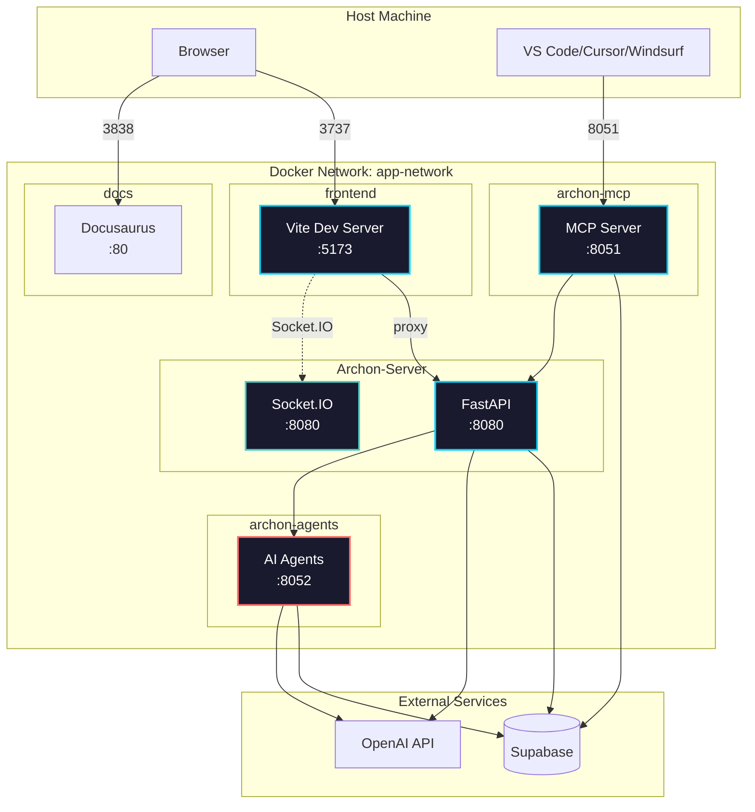

import Tabs from '@theme/Tabs';
import TabItem from '@theme/TabItem';
import Admonition from '@theme/Admonition';

# Configuration

## Docker Microservices Architecture

<Admonition type="info" title="Container Communication">
Archon uses a microservices architecture with three separate services. All services run in Docker containers and communicate via the `app-network` bridge network using service names, not localhost. Real-time features use Socket.IO for reliable real-time communication.
</Admonition>



### Port Mappings

| Service | Container Name | Container Port | Host Port | Purpose |
|---------|----------------|----------------|-----------|---------|
| Frontend | archon-frontend | 5173 | 3737 | React UI |
| Server | Archon-Server | 8080 | 8080 | FastAPI + Socket.IO |
| MCP Server | archon-mcp | 8051 | 8051 | AI Agent connections |
| AI Agents | archon-agents | 8052 | 8052 | AI processing service |
| Documentation | archon-docs | 80 | 3838 | This documentation |

## Essential Configuration

### 1. Environment Variables

Create a `.env` file in the root directory:

```bash
# Required - Get from supabase.com dashboard
SUPABASE_URL=https://your-project.supabase.co
SUPABASE_SERVICE_KEY=eyJ0eXAi...

# Optional - Set via UI Settings page
# OPENAI_API_KEY=sk-...

# Unified Logging Configuration (Optional)
LOGFIRE_ENABLED=false              # true=Logfire logging, false=standard logging  
# LOGFIRE_TOKEN=pylf_...            # Only required when LOGFIRE_ENABLED=true

# Service Discovery (automatically set for Docker)
# SERVICE_DISCOVERY_MODE=docker_compose
```

<Admonition type="tip" title="Configuration Options">
- **API Keys**: Set through the Settings page UI instead of environment variables
- **Logging**: Use `LOGFIRE_ENABLED=true/false` to toggle between standard and enhanced logging
- **Zero Setup**: Standard logging works perfectly without any additional configuration
</Admonition>

### Unified Logging Architecture

Archon includes a unified logging system that works seamlessly with or without Logfire:

```bash
# Standard Logging (Default - Zero Setup)
LOGFIRE_ENABLED=false

# Enhanced Logging with Logfire
LOGFIRE_ENABLED=true
LOGFIRE_TOKEN=your_token
```

**Key Benefits:**
- 🔄 **Single Toggle**: One environment variable controls everything
- 🛡️ **Always Works**: Graceful fallback to standard Python logging
- 📊 **Consistent**: Same log format and structure in both modes
- 🚀 **Zero Dependencies**: Standard logging requires no external services

### LLM Provider Configuration

Archon supports multiple LLM providers through the Settings UI:

- **OpenAI** (default) - Uses your existing OpenAI API key
- **Google Gemini** - Google's latest models
- **Ollama** - Run models locally (free)

Configure in **Settings → RAG Settings → LLM Provider**

<Admonition type="tip" title="Provider Setup">
- **API Keys**: Add provider-specific keys in Settings → API Keys
- **Ollama**: Requires local installation and custom base URL
- **Models**: Each provider has different model naming conventions
</Admonition>

### Socket.IO Configuration

Archon uses Socket.IO for all real-time features. The default configuration works out of the box:

```python
# Backend Socket.IO settings (socketio_app.py)
sio = socketio.AsyncServer(
    async_mode='asgi',
    cors_allowed_origins="*",  # Allow all origins for development
    ping_timeout=60,
    ping_interval=25
)
```

**Key Features:**
- **Automatic reconnection** with exponential backoff
- **Namespace-based** organization for different features
- **Room-based** broadcasting for targeted updates
- **Built-in** heartbeat and connection monitoring

### 2. Database Setup

<Tabs>
<TabItem value="new" label="New Installation">

1. Create a Supabase project at [supabase.com](https://supabase.com)
2. Copy credentials from Settings → API
3. Tables are auto-created on first run

</TabItem>
<TabItem value="reset" label="Reset Database">

Run this SQL in Supabase to completely reset:

```sql
-- Run migration/RESET_DB.sql
-- This removes ALL data and tables
```

Then restart the backend to recreate tables.

</TabItem>
</Tabs>

### 3. Starting the Application

```bash
# Start all services
docker compose up -d

# Check status
docker compose ps

# View logs
docker compose logs -f
```

## Docker Networking

<Admonition type="warning" title="Important">
Inside Docker containers, services communicate using container names, not `localhost`:
- Frontend → Server: `http://Archon-Server:8080`
- API → MCP: `http://archon-mcp:8051`
- API → Agents: `http://archon-agents:8052`
- Never use `localhost` in container-to-container communication
</Admonition>

### Common Issues

<Tabs>
<TabItem value="connection" label="Connection Refused">

**Problem**: Frontend can't connect to backend

**Solution**: Check `vite.config.ts` uses correct service name:
```typescript
proxy: {
  '/api': {
    target: 'http://Archon-Server:8080',
    ws: true
  }
}
```

</TabItem>
<TabItem value="socketio" label="Socket.IO Configuration">

**Problem**: Socket.IO connection issues

**Solution**: Ensure proper proxy configuration in `vite.config.ts`:
```typescript
proxy: {
  '/api': {
    target: 'http://Archon-Server:8080',
    changeOrigin: true,
    ws: true
  },
  '/socket.io': {
    target: 'http://Archon-Server:8080',
    changeOrigin: true,
    ws: true
  }
}
```

Socket.IO namespaces:
- Chat: `/chat`
- Crawl Progress: `/crawl`
- Task Updates: `/tasks`
- Project Creation: `/project`

</TabItem>
</Tabs>

## Quick Reference

### Health Checks

```bash
# API Service
curl http://localhost:8080/health

# MCP Server (checks socket connectivity)
curl http://localhost:8051/sse

# AI Agents Service
curl http://localhost:8052/health

# Frontend
curl http://localhost:3737
```

#### Frontend Health Check Configuration

The frontend performs automatic health checks to detect server disconnections. Configuration:

- **Check Interval**: 30 seconds (defined in `HEALTH_CHECK_INTERVAL_MS` constant)
- **Timeout**: 10 seconds per health check request
- **Disconnect Threshold**: 2 missed checks (60 seconds total)
- **Location**: `archon-ui-main/src/services/serverHealthService.ts`

To adjust the health check interval, modify the constant at the top of the file:
```typescript
const HEALTH_CHECK_INTERVAL_MS = 30000; // 30 seconds (default)
```

### Container Management

```bash
# Restart a specific service
docker compose restart archon-server

# Rebuild after code changes
docker compose build archon-server
docker compose up -d archon-server

# View real-time logs for a service
docker compose logs -f archon-server

# View all service logs
docker compose logs -f
```

### Service Discovery

Archon includes automatic service discovery that works across environments:

```python
from src.config.service_discovery import discovery

# Automatically detects environment
api_url = discovery.get_service_url("api")
# Docker: http://Archon-Server:8080
# Local: http://localhost:8080
```

## Next Steps

Once configured and running:

- **Web Interface**: Access at `http://localhost:3737`
- **API Documentation**: Available at `http://localhost:8080/docs`
- **MCP Connection**: Use `http://localhost:8051/sse` in your IDE
- **AI Agents API**: Available at `http://localhost:8052/docs`

<Admonition type="tip" title="Configuration Tips">
- All settings are stored in the Supabase database
- API keys can be configured through the web interface  
- Knowledge base content can be managed through the web interface
- MCP clients connect automatically once configured
- Each service can be scaled independently for better performance
</Admonition>