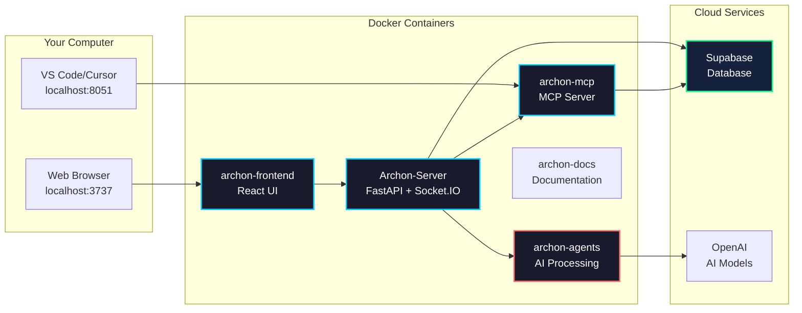

import Tabs from '@theme/Tabs';
import TabItem from '@theme/TabItem';
import Admonition from '@theme/Admonition';

# Deployment

## Quick Start

<Admonition type="tip" title="Prerequisites">
- Docker and Docker Compose installed
- Supabase account (free tier works)
- Git for cloning the repository
</Admonition>

### 1. Clone & Setup

```bash
# Clone repository
git clone <repository-url>
cd archon

# Create environment file
cp .env.example .env
```

### 2. Configure

Edit `.env` with your credentials:

```bash
SUPABASE_URL=https://your-project.supabase.co
SUPABASE_SERVICE_KEY=eyJ0eXAi...
```

### 3. Launch

```bash
# Start all services
docker-compose up -d

# Check status
docker-compose ps
```

### 4. Access

- **UI**: http://localhost:3737
- **API Docs**: http://localhost:8080/docs
- **Documentation**: http://localhost:3838

## Hot Module Reload (HMR)

<Admonition type="tip" title="Built-in Hot Reload">
Archon automatically includes Hot Module Reload for both Python server and React UI. Code changes are reflected immediately without container rebuilds.
</Admonition>

### What Changes Without Rebuild

<Tabs>
<TabItem value="python" label="Python Server">

**✅ No Rebuild Required:**
- Python source code changes (`.py` files)
- Configuration changes in code
- Business logic updates
- API endpoint modifications
- Socket.IO event handlers
- Service layer changes

**❌ Rebuild Required:**
- New pip dependencies in `requirements.*.txt`
- System package installations
- Dockerfile modifications
- Environment variable changes in docker-compose

</TabItem>
<TabItem value="frontend" label="React UI">

**✅ No Rebuild Required:**
- React components (`.tsx`, `.jsx`)
- CSS/Tailwind styles
- TypeScript code
- Static assets in `public/`
- Vite configuration (most changes)

**❌ Rebuild Required:**
- New npm dependencies in `package.json`
- Node version changes
- Build tool configurations
- Environment variable changes

</TabItem>
</Tabs>

### How HMR Works

**Python Server:**
- Uses `uvicorn --reload`
- Watches file changes automatically
- Restarts on save
- WebSocket connections re-establish after reload

**React UI:**
- Vite's built-in HMR
- Component state preserved when possible
- CSS updates without page reload
- Fast refresh for React components

### Tips

1. **Monitor Logs**: Watch for reload messages
   ```bash
   docker logs -f Archon-Server
   ```

2. **Handle Disconnects**: The UI shows a disconnect screen during server reload

3. **State Persistence**: Server state resets on reload, but database state persists

<Admonition type="warning" title="MCP Service Note">
The MCP service doesn't support hot reload. Restart manually after changes:
```bash
docker-compose restart archon-mcp
```
</Admonition>

## Service Architecture



## Common Commands

<Tabs>
<TabItem value="basic" label="Basic Operations">

```bash
# Start services
docker-compose up -d

# Stop services
docker-compose down

# View logs
docker-compose logs -f

# Restart a service
docker-compose restart archon-frontend
```

</TabItem>
<TabItem value="troubleshooting" label="Troubleshooting">

```bash
# Check container status
docker ps

# View service logs
docker logs archon-server
docker logs archon-mcp
docker logs archon-agents

# Rebuild after changes
docker-compose build
docker-compose up -d

# Complete reset
docker-compose down -v
docker-compose up -d --build
```

</TabItem>
</Tabs>

## Advanced Configuration

<Admonition type="info" title="Scaling Archon">
For team deployments, consider:
- Using a reverse proxy (nginx/Caddy) for multiple users
- Setting up SSL certificates for secure connections
- Configuring resource limits based on usage
- Using managed Supabase instances
</Admonition>

## Database Management

### Reset Database

<Admonition type="warning" title="Data Loss Warning">
This will delete ALL data in your database!
</Admonition>

```sql
-- Run in Supabase SQL editor
-- migration/RESET_DB.sql
```

### Backup Data

```bash
# Export data before reset
pg_dump -h your-db-host -U postgres -d postgres > backup.sql
```

## Monitoring

### Health Checks

```bash
# API Health
curl http://localhost:8080/health

# Check all services
echo "Frontend: http://localhost:3737"
curl -s http://localhost:3737 > /dev/null && echo "✓ Running" || echo "✗ Not running"

echo "API: http://localhost:8080/health"
curl -s http://localhost:8080/health | jq '.status' || echo "✗ Not running"

echo "MCP: http://localhost:8051/sse"
curl -s http://localhost:8051/sse > /dev/null && echo "✓ Running" || echo "✗ Not running"

echo "Agents: http://localhost:8052/health"
curl -s http://localhost:8052/health | jq '.status' || echo "✗ Not running"
```

### Container Resources

```bash
# View resource usage
docker stats

# Check disk usage
docker system df
```

## Next Steps

<Admonition type="success" title="Ready to Go!">
Your Archon instance is now running. Next:

1. **Set up API keys** in Settings
2. **Configure MCP** for AI agents
3. **Start crawling** knowledge sources
4. **Create projects** and tasks
</Admonition> 