import Tabs from '@theme/Tabs';
import TabItem from '@theme/TabItem';
import Admonition from '@theme/Admonition';


# 🚀 Getting Started with Archon

<div className="hero hero--primary">
  <div className="container">
    <h2 className="hero__subtitle">
      **Build Your AI's Knowledge Base** - From zero to operational in under 10 minutes
    </h2>
  </div>
</div>

<p align="center">
  <a href="#-quick-start">Quick Start</a> •
  <a href="#-whats-included">What's Included</a> •
  <a href="#-next-steps">Next Steps</a> •
  <a href="#-documentation-guide">Documentation Guide</a>
</p>

---
<Admonition type="tip" icon="🎯" title="What You'll Build">
By the end of this guide, you'll have a **fully operational Archon system** with:
- ✅ **14 MCP tools** enabled and working
- 🧠 **RAG system** for intelligent knowledge retrieval
- 🌐 **Archon UI** Command Center for knowledge, projects, and tasks
- 🔥 **Real-time Logfire monitoring** and debugging
- 🌐 **Modern UI** for project and task management
</Admonition>
---
## 🎯 What is Archon?

Archon is a **Model Context Protocol (MCP) server** that creates a centralized knowledge base for your AI coding assistants. Connect Cursor, Windsurf, or Claude Desktop to give your AI agents access to:

- **Your documentation** (crawled websites, uploaded PDFs/docs)
- **Smart search capabilities** with advanced RAG strategies  
- **Task management** integrated with your knowledge base
- **Real-time updates** as you add new content

## ⚡ Quick Start

### Prerequisites
- [Docker Desktop](https://www.docker.com/products/docker-desktop/) installed and running
- [Supabase](https://supabase.com/) account (free tier works)
- [OpenAI API key](https://platform.openai.com/api-keys) for embeddings

### 1. Clone & Setup

```bash
git clone https://github.com/coleam00/archon.git
cd archon

# Create environment file
cp .env.example .env
```

### 2. Configure Environment

Edit `.env` and add your credentials:

```bash
# Required
SUPABASE_URL=https://your-project.supabase.co
SUPABASE_SERVICE_KEY=your-service-key-here

# Optional (but recommended for monitoring)
OPENAI_API_KEY=sk-proj-your-openai-key
# Unified Logging Configuration (Optional)
LOGFIRE_ENABLED=false              # true=Logfire logging, false=standard logging
LOGFIRE_TOKEN=your-logfire-token-here    # Only required when LOGFIRE_ENABLED=true
```

### 3. Set Up Database

<Admonition type="info" icon="🗄️" title="Database Setup">
Create a new [Supabase project](https://supabase.com/dashboard), then follow these setup steps in order:
</Admonition>

#### Step 1: Initial Setup - Enable RAG Crawl and Document Upload
**Run `migration/1_initial_setup.sql`** - Creates vector database, settings, and core tables

#### Step 2: Install Projects Module
**Run `migration/2_archon_projects.sql`** - Creates project and task management tables

#### Step 3: Enable MCP Client Management (Optional)
**Run `migration/3_mcp_client_management.sql`** - Adds MCP client connection management features

#### 🔄 Database Reset (Optional)
**Run `migration/RESET_DB.sql`** - ⚠️ **Completely resets database (deletes ALL data!)**

<details>
<summary>🔍 **How to run SQL scripts in Supabase**</summary>

1. Go to your [Supabase Dashboard](https://supabase.com/dashboard)
2. Select your project
3. Navigate to **SQL Editor** in the left sidebar
4. Click **"New Query"**
5. Copy the contents of each migration file from your local files
6. Paste and click **"Run"**
7. Run each script in order: Step 1 → Step 2 → Step 3 (optional)

**For database reset:**
1. Run `RESET_DB.sql` first to clean everything
2. Then run migrations 1, 2, 3 in order to rebuild

</details>

### 4. Start Archon

```bash
# Build and start all services
docker compose up --build -d

# View logs (optional)
docker compose logs -f
```

<Admonition type="tip" icon="🔥" title="Hot Module Reload">
Archon includes Hot Module Reload (HMR) for both Python and React code. Changes to source files automatically reload without container rebuilds.

**No rebuild needed for:**
- Python code changes (`.py` files) 
- React components (`.tsx`, `.jsx`)
- CSS/Tailwind styles
- Most configuration changes

**Rebuild required for:**
- New dependencies (`requirements.txt`, `package.json`)
- Dockerfile changes
- Environment variables
</Admonition>

### 5. Access & Configure

| Service | URL | Purpose |
|---------|-----|---------|
| **🌐 Web Interface** | http://localhost:3737 | Main dashboard and controls |
| **📚 Documentation** | http://localhost:3838 | Complete setup and usage guides |
| **⚡ API Docs** | http://localhost:8080/docs | FastAPI documentation |

**Initial Configuration:**
1. Open the **Web Interface** (http://localhost:3737)
2. Go to **Settings** and add your OpenAI API key
3. Start the MCP server from the **MCP Dashboard**
4. Get connection details for your AI client

<Admonition type="success" icon="🎉" title="You're Ready!">
Your Archon system is now running with **14 MCP tools** available. Your AI agents can now access your knowledge base!
</Admonition>

## 🛠️ What's Included

When you run `docker compose up -d`, you get:

### Microservices Architecture
- **Frontend** (Port 3737): React dashboard for managing knowledge and tasks
- **API Service** (Port 8080): FastAPI server with Socket.IO for real-time features
- **MCP Service** (Port 8051): Model Context Protocol server for AI clients
- **Agents Service** (Port 8052): AI processing service for document analysis
- **Documentation** (Port 3838): Complete Docusaurus documentation site

### Key Features  
- **Smart Web Crawling**: Automatically detects sitemaps, text files, or webpages
- **Document Processing**: Upload PDFs, Word docs, markdown, and text files
- **AI Integration**: Connect any MCP-compatible client (Cursor, Windsurf, etc.)
- **Real-time Updates**: Socket.IO-based live progress tracking
- **Task Management**: Organize projects and tasks with AI agent integration

### Architecture Overview

```mermaid
%%{init:{
  'theme':'base',
  'themeVariables': {
    'primaryColor':'#1f2937',
    'primaryTextColor':'#ffffff',
    'primaryBorderColor':'#8b5cf6',
    'lineColor':'#a855f7',
    'textColor':'#ffffff',
    'fontFamily':'Inter',
    'fontSize':'14px',
    'background':'#000000',
    'mainBkg':'#1f2937',
    'secondBkg':'#111827',
    'borderColor':'#8b5cf6',
    'clusterBkg':'#111827',
    'clusterBorder':'#8b5cf6'
  }
}}%%
graph TB
    subgraph "🚀 Docker Microservices Stack"
        Frontend["🌐 Frontend Container<br/>React + Vite<br/>archon-frontend<br/>Port 3737"]
        API["⚡ Server Container<br/>FastAPI + Socket.IO<br/>Archon-Server<br/>Port 8080"]
        MCP["🔧 MCP Server<br/>14 MCP Tools<br/>archon-mcp<br/>Port 8051"]
        Agents["🤖 Agents Service<br/>AI Processing<br/>archon-agents<br/>Port 8052"]
        Docs["📚 Documentation<br/>Docusaurus<br/>archon-docs<br/>Port 3838"]
    end

    subgraph "☁️ External Services"
        Supabase["🗄️ Supabase<br/>PostgreSQL + pgvector"]
        OpenAI["🤖 OpenAI API<br/>Embeddings + Chat"]
        Logfire["🔥 Logfire<br/>Real-time Monitoring"]
    end

    Frontend --> API
    API --> MCP
    API --> Agents
    API --> Supabase
    API --> OpenAI
    MCP --> Logfire
    API --> Logfire
    Agents --> Logfire
    MCP --> Supabase
    Agents --> Supabase
```



## ⚡ Quick Test

Once everything is running:

1. **Test Document Upload**: Go to http://localhost:3737 → Documents → Upload a PDF
2. **Test Web Crawling**: Knowledge Base → "Crawl Website" → Enter a docs URL  
3. **Test AI Integration**: MCP Dashboard → Copy connection config for your AI client

## 🔌 Connecting to Cursor IDE

To connect Cursor to your Archon MCP server, add this configuration:

<Tabs>
<TabItem value="cursor" label="Cursor IDE" default>

**File**: `~/.cursor/mcp.json`

```json
{
  "mcpServers": {
    "archon": {
      "command": "docker",
      "args": [
        "exec", 
        "-i",
        "-e", "TRANSPORT=stdio",
        "-e", "HOST=localhost", 
        "-e", "PORT=8051",
        "archon-mcp",
        "python", "src/mcp_server.py"
      ]
    }
  }
}
```

</TabItem>
<TabItem value="other" label="Other Clients">

**For Windsurf, Claude Desktop, or other MCP clients:**

Check the **[MCP Overview](./mcp-overview)** for specific connection instructions for your AI client.

</TabItem>
</Tabs>

## 🎯 Next Steps

### Immediate Actions
1. **📚 [Build Your Knowledge Base](#building-your-knowledge-base)** - Start crawling and uploading content
2. **🔌 [Connect Your AI Client](./mcp-overview)** - Set up Cursor, Windsurf, or Claude Desktop  
3. **📊 [Monitor Performance](./configuration.mdx)** - Set up Logfire for real-time debugging

### Building Your Knowledge Base

<Tabs>
<TabItem value="crawl" label="🕷️ Web Crawling" default>

**Crawl Documentation Sites:**
1. Go to **Knowledge Base** in the web interface
2. Click **"Crawl Website"**
3. Enter a documentation URL (e.g., `https://docs.python.org`)
4. Monitor progress in real-time

**Pro Tips:**
- Start with well-structured documentation sites
- Use sitemap URLs when available (e.g., `sitemap.xml`)
- Monitor crawl progress via Socket.IO updates

</TabItem>
<TabItem value="upload" label="📄 Document Upload">

**Upload Documents:**
1. Go to **Documents** in the web interface
2. Click **"Upload Document"**
3. Select PDFs, Word docs, or text files
4. Add tags for better organization

**Supported Formats:**
- PDF files
- Word documents (.docx)
- Markdown files (.md)
- Plain text files (.txt)

</TabItem>
</Tabs>

### Advanced Setup

For production deployments and advanced features:

- **[Deployment Guide](./deployment.mdx)** - Production deployment strategies
- **[RAG Configuration](./rag.mdx)** - Advanced search and retrieval optimization
- **[Configuration Guide](./configuration.mdx)** - Comprehensive setup and monitoring
- **[API Reference](./api-reference.mdx)** - Complete REST API documentation

## 📖 Documentation Guide

This documentation is organized for different use cases:

### 🚀 Getting Started (You Are Here)
**QuickStart guide** to get Archon running in minutes

### 🔌 MCP Integration  
**[MCP Overview](./mcp-overview)** - Connect Cursor, Windsurf, Claude Desktop, and other MCP clients

### 🧠 RAG & Search
**[RAG Strategies](./rag.mdx)** - Configure intelligent search and retrieval for optimal AI responses

### 📊 Configuration & Monitoring
**[Configuration Guide](./configuration.mdx)** - Setup, monitoring, and Logfire integration

### 🚀 Production Deployment
**[Deployment Guide](./deployment.mdx)** - Scale Archon for team and production use

### 🛠️ Development
**[API Reference](./api-reference.mdx)** - REST API endpoints and development guides
**[Testing Guide](./testing.mdx)** - Development setup and testing procedures

## 🔧 Troubleshooting

<details>
<summary>**🐳 Container Issues**</summary>

```bash
# Check Docker status
docker --version
docker compose version

# Rebuild containers
docker compose down
docker compose up --build -d

# Check container logs
docker compose logs archon-server
docker compose logs archon-mcp
docker compose logs archon-agents
```

</details>

<details>
<summary>**🔌 Connection Issues**</summary>

```bash
# Verify environment variables
docker compose exec archon-server env | grep -E "(SUPABASE|OPENAI)"

# Check MCP server health
curl http://localhost:8051/sse

# Check API health
curl http://localhost:8080/health

# Check Agents service health
curl http://localhost:8052/health
```

</details>

<details>
<summary>**🧠 Empty RAG Results**</summary>

```bash
# Check available sources
curl http://localhost:8080/api/sources

# Test basic query
curl -X POST http://localhost:8080/api/rag/query \
  -H "Content-Type: application/json" \
  -d '{"query": "test", "match_count": 1}'
```

</details>

## 💬 Getting Help

- **📖 [Complete Documentation](http://localhost:3838)** - Comprehensive guides
- **🐛 [GitHub Issues](https://github.com/coleam00/archon/issues)** - Bug reports and feature requests
- **📊 [Logfire Dashboard](https://logfire.pydantic.dev/)** - Optional enhanced logging (when `LOGFIRE_ENABLED=true`)

---

<p align="center">
  <strong>Supercharging AI IDE's with knowledge and tasks</strong><br/>
  <em>Transform your AI coding experience with Archon</em>
</p> 