import Tabs from '@theme/Tabs';
import TabItem from '@theme/TabItem';
import Admonition from '@theme/Admonition';

# 🧠 Archon Knowledge: Your AI's Memory Bank

<div className="hero hero--primary">
  <div className="container">
    <h2 className="hero__subtitle">
      **Build a powerful knowledge base** for your AI assistants. Crawl websites, upload documents, and give your AI instant access to all your technical and business information.
    </h2>
  </div>
</div>

Archon Knowledge transforms your documentation, websites, and files into a searchable knowledge base that your AI coding assistants can instantly access. Never explain the same concept twice - your AI remembers everything.

<Admonition type="tip" icon="🎉" title="Fully Operational RAG System">
The RAG system is **now fully functional** with 14 MCP tools enabled, comprehensive error handling, and threading optimizations for high performance.
</Admonition>

## 🏗️ How RAG Works

```mermaid
%%{init:{
  'theme':'base',
  'themeVariables': {
    'primaryColor':'#1f2937',
    'primaryTextColor':'#ffffff',
    'primaryBorderColor':'#8b5cf6',
    'lineColor':'#a855f7',
    'textColor':'#ffffff',
    'fontFamily':'Inter',
    'fontSize':'14px',
    'background':'#000000',
    'mainBkg':'#1f2937',
    'secondBkg':'#111827',
    'borderColor':'#8b5cf6'
  }
}}%%
flowchart TD
    A[🤖 AI Agent Query] --> B[🧠 Generate Embeddings]
    B --> C[🔍 Vector Search]
    C --> D[📄 Matching Documents]
    D --> E[⚡ Filter & Rank]
    E --> F[📋 Return Results]
```



## ⚡ Performance Features

Archon Knowledge is optimized for speed and efficiency:

- **Smart Concurrency**: Adaptive processing based on system resources
- **Batch Processing**: Processes multiple documents efficiently  
- **Rate Limiting**: Respects API limits while maximizing throughput
- **Memory Management**: Automatically adjusts to available system memory

## 🔍 Using the Knowledge Base

### Basic Search

The `perform_rag_query` tool is the primary interface for semantic search across your knowledge base:

```javascript title="Basic RAG Query"
// Simple search across all sources
await mcp.callTool('perform_rag_query', {
  query: "authentication best practices",
  match_count: 5  // Optional, defaults to 5
});
```

### Filtered Search by Source

Filter results to specific domains or sources:

```javascript title="Source-Filtered Search"
// Search only within a specific domain
await mcp.callTool('perform_rag_query', {
  query: "MCP session management",
  source: "modelcontextprotocol.io",  // Filter by domain
  match_count: 10
});

// Get available sources first
const sources = await mcp.callTool('get_available_sources', {});
// Returns: ["ai.pydantic.dev", "modelcontextprotocol.io", ...]
```

### Advanced Usage Examples

<Tabs>
<TabItem value="technical" label="Technical Documentation" default>

```javascript
// Search for technical implementation details
await mcp.callTool('perform_rag_query', {
  query: "SSE transport implementation MCP protocol",
  source: "modelcontextprotocol.io",
  match_count: 5
});

// Response includes:
// - Matched content chunks
// - Source URLs
// - Similarity scores
// - Metadata (headers, context)
```

</TabItem>
<TabItem value="code" label="Code Examples">

```javascript
// Search for code examples
await mcp.callTool('search_code_examples', {
  query: "React hooks useState useEffect",
  source_id: "react.dev",  // Optional source filter
  match_count: 10
});

// Returns:
// - Code snippets with syntax highlighting
// - AI-generated summaries
// - Full context (before/after code)
// - Source file information
```

</TabItem>
<TabItem value="multi-source" label="Multi-Source Search">

```javascript
// Search across all indexed sources
const results = await mcp.callTool('perform_rag_query', {
  query: "best practices for API design REST GraphQL",
  // No source filter - searches everything
  match_count: 15
});

// Group results by source
const groupedResults = results.reduce((acc, result) => {
  const source = result.metadata.source;
  if (!acc[source]) acc[source] = [];
  acc[source].push(result);
  return acc;
}, {});
```

</TabItem>
</Tabs>

## 🔧 Advanced Features

- **Contextual Embeddings**: Enhanced understanding through document context
- **Source Filtering**: Search within specific domains or documentation sources  
- **Code Search**: Specialized search for code examples and implementations
- **Multi-Source**: Search across all your indexed knowledge sources simultaneously

## ⚡ Performance

<Admonition type="success" icon="📊" title="Fast & Efficient">
- **Average Query Time**: 200-300ms
- **Optimized Processing**: Smart batching and concurrency
- **Memory Adaptive**: Automatically adjusts to system resources
- **Rate Limited**: Respects API limits for reliable operation
</Admonition>

## 📊 Real-Time Progress

When processing large amounts of content, Archon provides real-time progress updates via Socket.IO:

- **Smooth Progress**: Linear progression from 0-100%
- **Batch Details**: Clear information about processing status
- **Real-Time Updates**: Live updates as documents are processed
- **Memory Awareness**: Automatically adjusts based on system resources

## 🗄️ Data Storage

Archon uses a vector database to store and search your knowledge:

- **Vector Embeddings**: Content is converted to high-dimensional vectors for semantic search
- **Source Tracking**: Each document is linked to its original source
- **Code Examples**: Special handling for code snippets with language detection
- **Metadata Storage**: Additional context and headers are preserved

## 🔧 Common Issues

### Performance
- **Slow searches**: Usually due to large document sets - the system automatically optimizes batch sizes
- **Memory usage**: Adaptive processing automatically adjusts based on available system memory
- **Rate limiting**: Built-in rate limiting prevents API quota issues

### Search Quality  
- **Poor results**: Try different search terms or use source filtering to narrow results
- **Missing content**: Ensure documents are properly crawled and indexed
- **Code examples**: Use the specialized `search_code_examples` tool for better code results

## 🚀 Getting Started

1. **Add Knowledge Sources**: Use MCP tools to crawl websites and upload documents
2. **Search Your Knowledge**: Use `perform_rag_query` to find relevant information  
3. **Filter by Source**: Search within specific domains when you need focused results
4. **Find Code Examples**: Use `search_code_examples` for code-specific searches

## 🔮 What's Next

Future enhancements include multi-model processing, hybrid search combining vector and keyword search, and advanced neural reranking for even better results. 