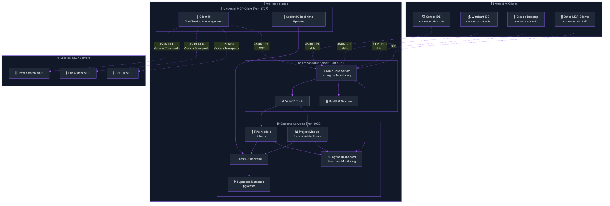

import Tabs from '@theme/Tabs';
import TabItem from '@theme/TabItem';
import Admonition from '@theme/Admonition';

# Model Context Protocol (MCP) Overview

<Admonition type="info" icon="🎯" title="Architecture Clarification">

**Archon's MCP implementation follows a clear separation of concerns:**
- The **Server service** contains ALL business logic, ML models, and data operations
- The **MCP service** is a lightweight HTTP-based wrapper that exposes Server functionality as MCP tools
- **MCP communicates with Server exclusively via HTTP APIs** - maintaining true microservices separation

</Admonition>

## What is MCP?

The Model Context Protocol (MCP) is an open standard that enables AI applications to securely access external data sources and tools. Archon implements both sides of MCP:

- **MCP Server**: Exposes 14 tools following action-based patterns for knowledge management and task organization
- **MCP Client**: Universal SSE-based client for connecting to any MCP server using Streamable HTTP transport

<div className="row">
  <div className="col col--6">
    <div className="card">
      <div className="card__header">
        <h3>MCP Server</h3>
      </div>
      <div className="card__body">
        <p>Archon as an MCP Server - Expose your knowledge base to AI clients</p>
        <ul>
          <li>14 comprehensive tools using flexible action-based patterns</li>
          <li>Real-time Logfire monitoring of all tool calls</li>
          <li>Compatible with Cursor, Windsurf, Claude Desktop</li>
          <li>SSE transport for all clients (stdio via docker exec)</li>
        </ul>
        <a href="/mcp-server" className="button button--primary">
          MCP Server Documentation
        </a>
      </div>
    </div>
  </div>
  <div className="col col--6">
    <div className="card">
      <div className="card__header">
        <h3>MCP Client</h3>
      </div>
      <div className="card__body">
        <p>Universal MCP Client - Connect to any SSE-based MCP server from Archon's UI</p>
        <ul>
          <li>Connect to any MCP server using Streamable HTTP (SSE) transport</li>
          <li>Interactive tool testing with real-time results</li>
          <li>Socket.IO real-time updates for collaborative workflows</li>
          <li>Simple configuration - just provide the SSE endpoint URL</li>
        </ul>
        <a href="/mcp-client" className="button button--primary">
          MCP Client Documentation
        </a>
      </div>
    </div>
  </div>
</div>

## Archon MCP Architecture



## Quick Start Guide

<Tabs>
<TabItem value="server" label="Using Archon as MCP Server" default>

Connect your AI client to Archon's knowledge base:

1. Start Archon (Docker or local)
2. Configure your AI client (Cursor, Windsurf, etc.)
3. Begin using 14 comprehensive tools

**For Cursor:**
```json title="MCP Settings"
{
  "mcpServers": {
    "archon": {
      "uri": "http://localhost:8051/sse"
    }
  }
}
```

**For Claude Code:**
```bash
claude mcp add --transport sse archon http://localhost:8051/sse
```

**For Windsurf:**
```json
{
  "mcp.servers": {
    "archon": {
      "uri": "http://localhost:8051/sse"
    }
  }
}
```

**Available capabilities:**
- RAG queries across your crawled knowledge
- Create and manage tasks/projects
- Search code examples with AI summaries
- Document management with versioning

</TabItem>
<TabItem value="client" label="Using Universal MCP Client">

Connect to any MCP server from Archon's UI:

1. Open Archon UI → Navigate to MCP Client tab
2. Add MCP servers (Brave Search, GitHub, Filesystem, etc.)
3. Test tools interactively with real-time results
4. Monitor all connections with Socket.IO updates

**Connect to Popular MCP Servers:**
- **Brave Search**: Web search capabilities
- **GitHub**: Repository management
- **Filesystem**: Local file operations
- **Archon**: Your own knowledge base
- **Custom**: Any MCP-compatible server

</TabItem>
</Tabs>

## 📊 Tool Distribution

<Admonition type="info" icon="📊" title="Complete Tool Overview">

**Archon provides 14 comprehensive MCP tools following modern patterns:**

</Admonition>

| Category | Tools | Description | Key Features |
|----------|-------|-------------|--------------|
| **🧠 RAG & Knowledge Management** | 7 tools | Search, crawl, and manage knowledge | RAG queries, web crawling, document upload, code search, source management |
| **📊 Project & Task Management** | 5 tools | Complete project lifecycle management | Consolidated action-based patterns for projects, tasks, documents, and versions |
| **🏥 System Health** | 2 tools | Health monitoring and diagnostics | Comprehensive system status and session management |

### Tool Categories Deep Dive

<div className="row">
  <div className="col col--4">
    <div className="card">
      <div className="card__header">
        <h4>🧠 **RAG & Knowledge Tools (7)**</h4>
      </div>
      <div className="card__body">
        <ul>
          <li>`perform_rag_query` - Semantic search</li>
          <li>`search_code_examples` - Code-specific search</li>
          <li>`crawl_single_page` - Web page indexing</li>
          <li>`smart_crawl_url` - Intelligent crawling</li>
          <li>`upload_document` - Document processing</li>
          <li>`get_available_sources` - Source management</li>
          <li>`delete_source` - Source cleanup</li>
        </ul>
      </div>
    </div>
  </div>
  <div className="col col--4">
    <div className="card">
      <div className="card__header">
        <h4>📊 **Project Tools (5)**</h4>
      </div>
      <div className="card__body">
        <ul>
          <li>`manage_project` - Create, list, get, delete projects</li>
          <li>`manage_task` - Create, list, get, update, delete, archive tasks</li>
          <li>`manage_document` - Add, list, get, update, delete documents</li>
          <li>`manage_versions` - Create, list, get, restore versions</li>
          <li>`get_project_features` - Retrieve project features</li>
        </ul>
      </div>
    </div>
  </div>
  <div className="col col--4">
    <div className="card">
      <div className="card__header">
        <h4>🏥 **System & Monitoring (2)**</h4>
      </div>
      <div className="card__body">
        <ul>
          <li>`health_check` - System health diagnostics</li>
          <li>`session_info` - Session management info</li>
          <li>**Real-time Logfire tracing** for all tools</li>
          <li>**Performance metrics** and timing</li>
          <li>**Client identification** (Cursor, Windsurf, etc.)</li>
          <li>**Error tracking** and debugging</li>
        </ul>
      </div>
    </div>
  </div>
</div>

## 🔥 Why Choose Archon's MCP Implementation?

### 🏆 Industry-Leading Features

<div className="row">
  <div className="col col--6">
    <div className="card">
      <div className="card__header">
        <h4>⚡ **Performance & Reliability**</h4>
      </div>
      <div className="card__body">
        <ul>
          <li>🚀 **Sub-second response times** for most queries</li>
          <li>🔄 **Automatic reconnection** and error recovery</li>
          <li>📊 **Comprehensive monitoring** with Logfire</li>
          <li>🏥 **Health checks** and system diagnostics</li>
          <li>⚖️ **Load balancing** for high-volume usage</li>
        </ul>
      </div>
    </div>
  </div>
  <div className="col col--6">
    <div className="card">
      <div className="card__header">
        <h4>🛡️ **Security & Scalability**</h4>
      </div>
      <div className="card__body">
        <ul>
          <li>🔐 **Encrypted credential storage** in Supabase</li>
          <li>🌐 **Multi-transport support** (stdio, SSE)</li>
          <li>🔄 **Real-time synchronization** across clients</li>
          <li>📈 **Horizontal scaling** ready</li>
          <li>🎯 **Rate limiting** and abuse protection</li>
        </ul>
      </div>
    </div>
  </div>
</div>

### 🔧 Developer Experience

<Admonition type="tip" icon="🔥" title="Built for Developers, by Developers">

**Archon's MCP implementation prioritizes developer experience with comprehensive tooling, detailed documentation, and real-time debugging capabilities.**

</Admonition>

- **📝 Extensive Documentation**: Every tool documented with examples
- **🧪 Interactive Testing**: Test tools directly in the UI
- **🔍 Real-time Debugging**: Logfire traces for every operation  
- **⚡ Hot Reloading**: Development-friendly configuration
- **🌐 Universal Compatibility**: Works with any MCP client

## 📚 Documentation Structure

### 📖 Detailed Guides

| Document | Purpose | Audience |
|----------|---------|----------|
| **[🛠️ MCP Server Guide](/mcp-server)** | Complete server setup, configuration, and troubleshooting | Developers using Archon as an MCP server |
| **[🔌 MCP Client Guide](/mcp-client)** | Universal client usage, server connections, and testing | Developers connecting to MCP servers |

### 🎯 Quick Navigation

<div className="row">
  <div className="col col--4">
    <div className="card">
      <div className="card__header">
        <h4>🚀 **Getting Started**</h4>
      </div>
      <div className="card__body">
        <ul>
          <li>[Server Setup](/mcp-server#setup)</li>
<li>[Client Configuration](/mcp-client#configuration)</li>
<li>[First Tool Call](/mcp-server#first-tool-call)</li>
        </ul>
      </div>
    </div>
  </div>
  <div className="col col--4">
    <div className="card">
      <div className="card__header">
        <h4>🔧 **Troubleshooting**</h4>
      </div>
      <div className="card__body">
        <ul>
          <li>[Server Issues](/mcp-server#troubleshooting)</li>
<li>[Client Problems](/mcp-client#troubleshooting)</li>
<li>[Environment Variables](/mcp-server#environment-setup)</li>
        </ul>
      </div>
    </div>
  </div>
  <div className="col col--4">
    <div className="card">
      <div className="card__header">
        <h4>📊 **Advanced Usage**</h4>
      </div>
      <div className="card__body">
        <ul>
          <li>[Tool Development](/mcp-server#custom-tools)</li>
<li>[Performance Tuning](/mcp-server#performance)</li>
<li>[Monitoring Setup](/mcp-server#monitoring)</li>
        </ul>
      </div>
    </div>
  </div>
</div>

## 🎉 Ready to Get Started?

Choose your path based on how you want to use Archon's MCP capabilities:

<Tabs>
<TabItem value="expose" label="🛠️ Expose Archon as MCP Server">

**You want to connect external AI clients (Cursor, Windsurf, etc.) to Archon's knowledge base**

👉 **[Start with MCP Server Documentation](/mcp-server)**

</TabItem>
<TabItem value="connect" label="🔌 Connect to MCP Servers">

**You want to use Archon's UI to connect to and test various MCP servers**

👉 **[Start with MCP Client Documentation](/mcp-client)**

</TabItem>
<TabItem value="both" label="🚀 Use Both Capabilities">

**You want to use Archon as both a server and client for maximum functionality**

👉 **Start with [MCP Server](/mcp-server), then [MCP Client](/mcp-client)**

</TabItem>
</Tabs>

---

<div className="text--center">
  <p><strong>🔥 Ready to experience the most powerful MCP implementation available?</strong></p>
  <p>Join thousands of developers already using Archon's MCP tools to supercharge their AI workflows!</p>
</div> 