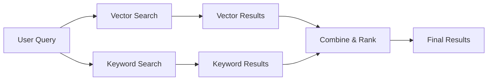
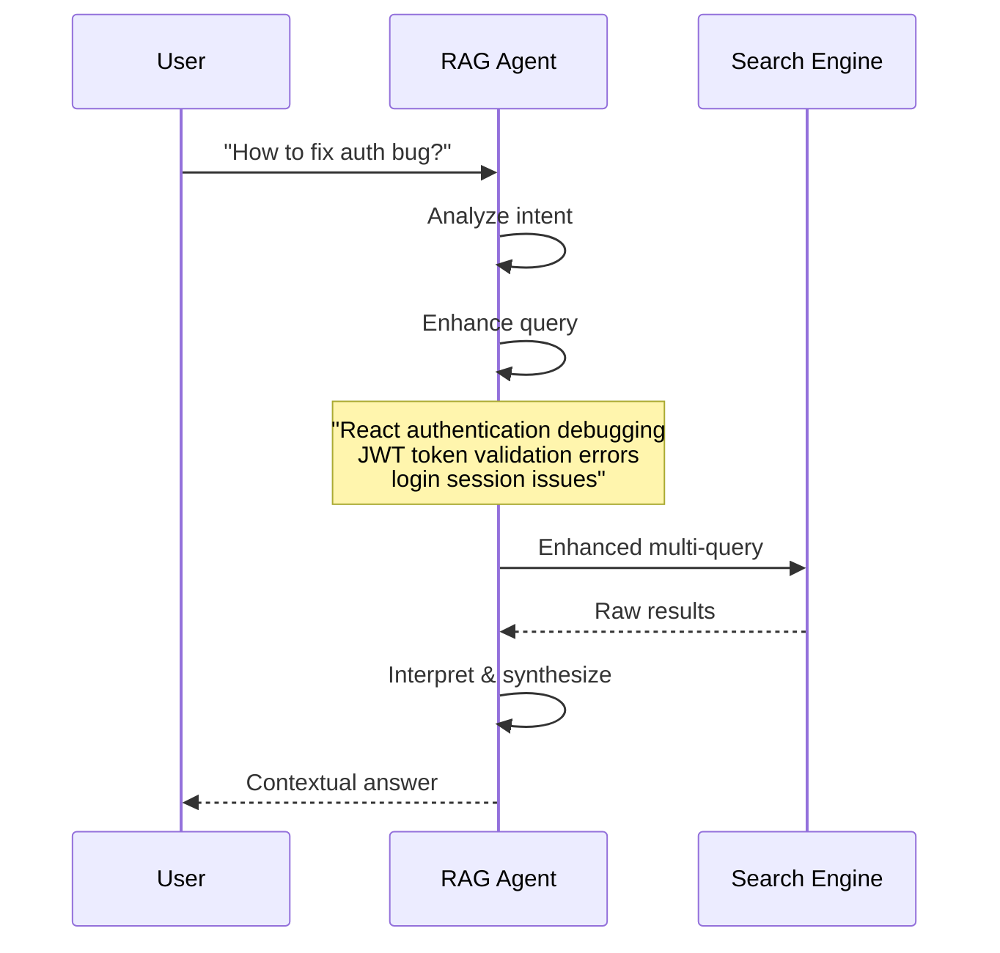
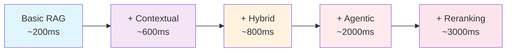

import Tabs from '@theme/Tabs';
import TabItem from '@theme/TabItem';
import Admonition from '@theme/Admonition';

# 🧠 RAG Configuration & Strategies

<div className="hero hero--primary">
  <div className="container">
    <h2 className="hero__subtitle">
      **Configure intelligent search and retrieval** for optimal AI responses using advanced RAG strategies
    </h2>
  </div>
</div>

## 🎯 Overview

Archon's RAG (Retrieval-Augmented Generation) system provides configurable search strategies to optimize how your AI agents find and use information from your knowledge base. This guide covers configuration options and optimization strategies.

<Admonition type="tip" icon="⚡" title="Quick Configuration">
Access RAG settings in the **Web Interface** → **Settings** → **RAG Settings** for easy configuration without code changes.
</Admonition>

## 🛠️ RAG Configuration Options

### Core Settings

| Setting | Description | Default | Impact |
|---------|-------------|---------|--------|
| **MODEL_CHOICE** | Chat model for query enhancement | `gpt-4o-mini` | Response quality |
| **EMBEDDING_MODEL** | Model for vector embeddings | `text-embedding-3-small` | Search accuracy |
| **LLM_PROVIDER** | Provider (openai/google/ollama/) | `openai` | Model availability |

### Advanced Strategies

| Strategy | Purpose | Performance Impact | Use Cases |
|----------|---------|-------------------|-----------|
| **Contextual Embeddings** | Enhanced embeddings with context | +30% accuracy, +2x time | Technical docs, code |
| **Hybrid Search** | Vector + keyword combination | +20% accuracy, +50% time | Mixed content types |
| **Agentic RAG** | AI-powered query enhancement | +40% accuracy, +3x time | Complex queries |
| **Reranking** | AI-powered result reordering | +25% accuracy, +2x time | High-precision needs |

## ⚙️ Configuration Strategies

### 1. Basic Configuration (Fastest)
**Best for**: General documentation, simple queries
```bash
# Minimal settings for speed
USE_CONTEXTUAL_EMBEDDINGS=false
USE_HYBRID_SEARCH=false
USE_AGENTIC_RAG=false
USE_RERANKING=false
```

### 2. Balanced Configuration (Recommended)
**Best for**: Most production use cases
```bash
# Balanced performance and accuracy
USE_CONTEXTUAL_EMBEDDINGS=true
CONTEXTUAL_EMBEDDINGS_MAX_WORKERS=3
USE_HYBRID_SEARCH=true
USE_AGENTIC_RAG=false
USE_RERANKING=false
```

### 3. High-Accuracy Configuration
**Best for**: Critical applications, complex technical docs
```bash
# Maximum accuracy (slower)
USE_CONTEXTUAL_EMBEDDINGS=true
CONTEXTUAL_EMBEDDINGS_MAX_WORKERS=3
USE_HYBRID_SEARCH=true
USE_AGENTIC_RAG=true
USE_RERANKING=true
```

## 🔍 RAG Strategies Explained

### Contextual Embeddings
**Enhances embeddings with surrounding document context**

<Tabs>
<TabItem value="how" label="How It Works" default>

```python
# Standard embedding
"authentication" → [0.1, 0.3, 0.7, ...]

# Contextual embedding (with document context)
"authentication in React components using JWT tokens" → [0.2, 0.4, 0.8, ...]
```

**Benefits:**
- Better understanding of domain-specific terms
- Improved accuracy for technical content
- Context-aware search results

</TabItem>
<TabItem value="config" label="Configuration">

```bash
# Enable contextual embeddings
USE_CONTEXTUAL_EMBEDDINGS=true

# Control API rate limiting (1-20 workers)
CONTEXTUAL_EMBEDDINGS_MAX_WORKERS=3
```

**Performance Tuning:**
- **Workers = 1**: Slowest, no rate limiting issues
- **Workers = 3**: Balanced speed and reliability  
- **Workers = 8+**: Fastest, may hit OpenAI rate limits

</TabItem>
</Tabs>

### Hybrid Search
**Combines vector similarity with keyword matching**

<Tabs>
<TabItem value="strategy" label="Search Strategy" default>



**Use Cases:**
- Mixed content (docs + code + APIs)
- Exact term matching needed
- Better coverage of rare terms

</TabItem>
<TabItem value="example" label="Example Results">

**Query**: "React authentication JWT"

**Vector Search Results:**
- Authentication patterns in React
- JWT token handling best practices
- Security considerations for SPAs

**Keyword Search Results:**  
- Exact matches for "JWT"
- Code examples with "React" + "auth"
- API documentation mentioning tokens

**Combined Results:**
- Higher relevance through multiple signals
- Better coverage of technical terms
- Reduced false negatives

</TabItem>
</Tabs>

### Agentic RAG
**AI-powered query enhancement and result interpretation**

<Tabs>
<TabItem value="workflow" label="Enhanced Workflow" default>



</TabItem>
<TabItem value="capabilities" label="AI Capabilities">

**Query Enhancement:**
- Intent analysis and clarification
- Synonym expansion and context addition
- Multi-query strategy for complex questions

**Result Processing:**
- Relevance filtering and ranking
- Answer synthesis from multiple sources  
- Code example extraction and formatting

**Adaptive Learning:**
- Learns from successful query patterns
- Adapts to user terminology and context
- Improves over time with usage

</TabItem>
</Tabs>

### Reranking
**AI-powered result reordering for optimal relevance**

<Tabs>
<TabItem value="process" label="Reranking Process" default>

```python
# Initial search results (vector similarity)
results = [
    {"content": "JWT basics", "score": 0.85},
    {"content": "React auth patterns", "score": 0.83},
    {"content": "Token validation", "score": 0.81}
]

# AI reranking (considering query context)
reranked = [
    {"content": "React auth patterns", "score": 0.95},  # ↑ More relevant 
    {"content": "Token validation", "score": 0.88},    # ↑ Contextually better
    {"content": "JWT basics", "score": 0.78}          # ↓ Too generic
]
```

</TabItem>
<TabItem value="benefits" label="Benefits">

**Improved Relevance:**
- Context-aware ranking beyond similarity
- Understands query intent and user needs
- Reduces noise from generic results

**Better User Experience:**
- Most relevant results appear first
- Reduced time to find information
- Higher satisfaction with search results

</TabItem>
</Tabs>

## 📊 Performance Optimization

### Speed vs Accuracy Trade-offs



### Recommended Configurations by Use Case

#### Development & Testing
```bash
# Fast iteration, basic accuracy
USE_CONTEXTUAL_EMBEDDINGS=false
USE_HYBRID_SEARCH=false
USE_AGENTIC_RAG=false
USE_RERANKING=false
# ~200ms average query time
```

#### Production Documentation
```bash
# Balanced performance
USE_CONTEXTUAL_EMBEDDINGS=true
CONTEXTUAL_EMBEDDINGS_MAX_WORKERS=3
USE_HYBRID_SEARCH=true
USE_AGENTIC_RAG=false
USE_RERANKING=false
# ~800ms average query time
```

#### Mission-Critical Applications
```bash
# Maximum accuracy
USE_CONTEXTUAL_EMBEDDINGS=true
CONTEXTUAL_EMBEDDINGS_MAX_WORKERS=2  # Conservative for reliability
USE_HYBRID_SEARCH=true
USE_AGENTIC_RAG=true
USE_RERANKING=true
# ~3000ms average query time
```

## 🔧 Provider-Specific Configuration

### OpenAI (Recommended)
```bash
LLM_PROVIDER=openai
MODEL_CHOICE=gpt-4o-mini
EMBEDDING_MODEL=text-embedding-3-small
# Pros: Best accuracy, reliable API
# Cons: Cost per query
```

### Google Gemini
```bash
LLM_PROVIDER=google
LLM_BASE_URL=https://generativelanguage.googleapis.com/v1beta
MODEL_CHOICE=gemini-2.5-flash
EMBEDDING_MODEL=text-embedding-004
# Pros: Good performance, competitive pricing
# Cons: Different API patterns
```

### Ollama (Local/Private)
```bash
LLM_PROVIDER=ollama
LLM_BASE_URL=http://localhost:11434/v1
MODEL_CHOICE=llama2
EMBEDDING_MODEL=nomic-embed-text
# Pros: Privacy, no API costs
# Cons: Local compute requirements
```

## 📈 Monitoring & Analytics

### Key Metrics to Track

```bash
# Query Performance
- Average response time
- Cache hit rate
- Error rate by strategy

# Search Quality  
- Result relevance scores
- User interaction patterns
- Query refinement frequency

# System Health
- API rate limit usage
- Embedding generation time
- Memory usage patterns
```

### Optimization Recommendations

#### If Queries Are Too Slow:
1. Reduce `CONTEXTUAL_EMBEDDINGS_MAX_WORKERS`
2. Disable `USE_AGENTIC_RAG` for simple queries
3. Implement result caching
4. Use lighter embedding models

#### If Results Are Inaccurate:
1. Enable `USE_CONTEXTUAL_EMBEDDINGS`
2. Add `USE_HYBRID_SEARCH` for mixed content
3. Consider `USE_RERANKING` for critical applications
4. Improve source document quality

#### If Hitting Rate Limits:
1. Reduce max workers: `CONTEXTUAL_EMBEDDINGS_MAX_WORKERS=1`
2. Implement exponential backoff
3. Use caching more aggressively
4. Consider switching to local models (Ollama)

## 🎯 Best Practices

### Content Optimization
1. **Document Structure**: Use clear headings and sections
2. **Code Examples**: Include working code snippets
3. **Context**: Provide sufficient surrounding context
4. **Tags**: Use descriptive tags for better categorization

### Query Optimization
1. **Be Specific**: "React authentication with JWT" vs "auth"
2. **Use Technical Terms**: Include framework/library names
3. **Provide Context**: Mention your specific use case
4. **Iterate**: Refine queries based on initial results

### System Tuning
1. **Start Simple**: Begin with basic configuration
2. **Measure Impact**: Enable one strategy at a time
3. **Monitor Performance**: Track both speed and accuracy
4. **User Feedback**: Collect feedback on result quality

## 🔗 Related Documentation

- [RAG Agent](./agent-rag) - AI agent that orchestrates RAG searches
- [MCP Tools](./mcp-tools) - RAG-related MCP tools and endpoints
- [Knowledge Features](./knowledge-features) - Knowledge base management
- [Configuration Guide](./configuration) - Complete system configuration 