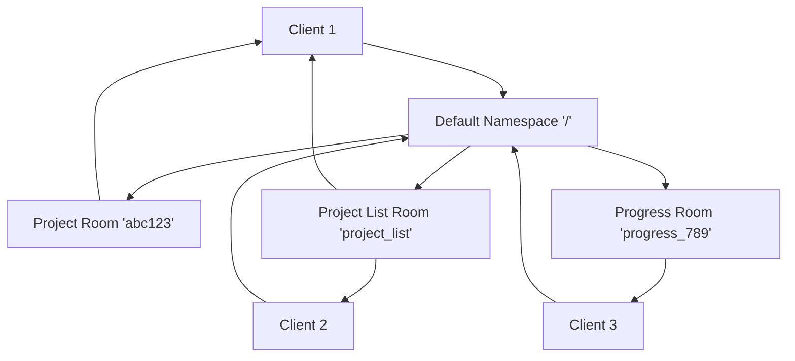

import Tabs from '@theme/Tabs';
import TabItem from '@theme/TabItem';
import Admonition from '@theme/Admonition';

# Real-time Communication with Socket.IO

## Overview

Archon uses **Socket.IO** for real-time communication between the frontend and backend. We follow 2025 best practices - all events on the default namespace with room-based organization.

<Admonition type="success" title="Simple by Design">
- **Default namespace only**: Everything on root `/` namespace
- **Room-based organization**: Projects, progress tracking, and features use rooms
- **Simple events**: Clear event names with `@sio.event` decorators
- **Automatic reconnection**: Socket.IO handles connection reliability
- **~100 lines total**: For the entire real-time system
</Admonition>

## Socket.IO Rooms Architecture

Rooms provide isolated communication channels within the default namespace:

### Room Types

| Room Pattern | Purpose | Example Room ID | Members |
|--------------|---------|-----------------|---------|
| `project_list` | Project list updates | `project_list` | Users viewing project dashboard |
| `{project_id}` | Project-specific updates | `abc123-def456` | Users viewing that project |
| `{progress_id}` | Progress tracking | `progress_789` | Users tracking creation/crawl progress |
| `chat_{session_id}` | Agent chat sessions | `chat_session_123` | Individual chat participants |

## Socket.IO Events

All events use simple names on the root namespace:

| Event | Direction | Purpose | Data Format |
|-------|-----------|---------|-------------|
| `connect` | Server→Client | Connection established | `{sid: string}` |
| `disconnect` | Server→Client | Connection closed | None |
| `join_project` | Client→Server | Join project room for task updates | `{project_id: string}` |
| `leave_project` | Client→Server | Leave project room | `{project_id: string}` |
| `subscribe_projects` | Client→Server | Subscribe to project list updates | None |
| `unsubscribe_projects` | Client→Server | Unsubscribe from project list | None |
| `subscribe_progress` | Client→Server | Subscribe to creation progress | `{progress_id: string}` |
| `unsubscribe_progress` | Client→Server | Unsubscribe from progress | `{progress_id: string}` |
| `crawl_subscribe` | Client→Server | Subscribe to crawl progress | `{progress_id: string}` |
| `crawl_unsubscribe` | Client→Server | Unsubscribe from crawl | `{progress_id: string}` |
| `crawl_stop` | Client→Server | Stop an active crawl | `{progress_id: string}` |

## Broadcast Events

These are emitted by the server to rooms:

| Event | Purpose | Room | Data |
|-------|---------|------|------|
| `task_created` | New task created | project_id | Task object |
| `task_updated` | Task modified | project_id | Task object |
| `task_deleted` | Task removed | project_id | `{task_id: string}` |
| `projects_update` | Project list changed | 'project_list' | `{projects: Array}` |
| `project_progress` | Creation progress | progress_id | Progress data |
| `crawl_progress` | Crawl progress | progress_id | Progress data |
| `crawl:stopping` | Crawl is stopping | progress_id | `{progressId, status, message}` |
| `crawl:stopped` | Crawl has stopped | progress_id | `{progressId, status, message, timestamp}` |

## Frontend Usage

<Tabs>
<TabItem value="basic" label="Room-Based Connection">

```typescript
import { createWebSocketService } from './services/webSocketService';

// Always connect to default namespace
const ws = createWebSocketService();
await ws.connect('/');

// Join specific rooms via events
ws.send({ 
  type: 'join_project', 
  data: { project_id: 'abc123' } 
});

// Subscribe to project list room
ws.send({ type: 'subscribe_projects' });

// Listen for room-specific updates
ws.addMessageHandler('task_created', (message) => {
  console.log('New task in project room:', message.data);
});

ws.addMessageHandler('projects_update', (message) => {
  console.log('Project list updated:', message.data.projects);
});
```

</TabItem>
<TabItem value="progress" label="Progress Room Tracking">

```typescript
// Subscribe to progress room
ws.send({ 
  type: 'subscribe_progress', 
  data: { progress_id: progressId }
});

// Handle progress updates from room
ws.addMessageHandler('project_progress', (message) => {
  const { percentage, status, step } = message.data;
  updateProgress(percentage, status, step);
});

// Unsubscribe from progress room
ws.send({
  type: 'unsubscribe_progress',
  data: { progress_id: progressId }
});
```

</TabItem>
<TabItem value="service" label="Service Pattern">

```typescript
class ProjectProgressService {
  private wsService: WebSocketService | null = null;
  
  async streamProgress(progressId: string, onMessage: (data: any) => void) {
    this.wsService = createWebSocketService();
    
    // Always connect to default namespace
    await this.wsService.connect('/');
    
    // Subscribe to progress room
    this.wsService.send({
      type: 'subscribe_progress',
      data: { progress_id: progressId }
    });
    
    // Handle room messages
    this.wsService.addMessageHandler('project_progress', (message) => {
      onMessage(message.data);
    });
  }
  
  disconnect() {
    if (this.wsService) {
      // Rooms are cleaned up automatically
      this.wsService.disconnect();
    }
  }
}
```

</TabItem>
</Tabs>

## Backend Implementation

All Socket.IO code lives in `projects_api.py`:

<Tabs>
<TabItem value="events" label="Event Handlers">

```python
# Get Socket.IO instance
from ..socketio_app import get_socketio_instance
sio = get_socketio_instance()

# Simple event handlers
@sio.event
async def connect(sid, environ):
    print(f'Client connected: {sid}')

@sio.event
async def join_project(sid, data):
    project_id = data.get('project_id')
    if project_id:
        await sio.enter_room(sid, project_id)
        # Send initial tasks
        tasks = await get_project_tasks(project_id)
        await sio.emit('initial_tasks', tasks, to=sid)

@sio.event
async def subscribe_projects(sid):
    await sio.enter_room(sid, 'project_list')
    # Send current projects
    projects = await get_all_projects()
    await sio.emit('projects_update', {'projects': projects}, to=sid)

@sio.event
async def crawl_subscribe(sid, data):
    progress_id = data.get('progress_id')
    if progress_id:
        await sio.enter_room(sid, progress_id)
```

</TabItem>
<TabItem value="broadcast" label="Broadcasting">

```python
# Simple broadcast helpers
async def broadcast_task_update(project_id: str, event_type: str, task_data: dict):
    """Broadcast task updates to project room."""
    await sio.emit(event_type, task_data, room=project_id)

async def broadcast_project_update():
    """Broadcast project list to subscribers."""
    projects = await get_all_projects()
    await sio.emit('projects_update', {'projects': projects}, room='project_list')

async def broadcast_crawl_progress(progress_id: str, data: dict):
    """Broadcast crawl progress to subscribers."""
    # Include the progress_id in data for client-side filtering
    data['progressId'] = progress_id
    await sio.emit('crawl_progress', data, room=progress_id)

# Usage in services
await broadcast_task_update(project_id, 'task_created', new_task)
await broadcast_crawl_progress(progress_id, {'percentage': 50, 'status': 'crawling'})
```

</TabItem>
</Tabs>

## Server Configuration

The Socket.IO server is configured in `socketio_app.py`:

```python
import socketio

# Create server with simple settings
sio = socketio.AsyncServer(
    async_mode='asgi',
    cors_allowed_origins="*",
    logger=False,
    engineio_logger=False,
    max_http_buffer_size=1000000,  # 1MB
    ping_timeout=60,
    ping_interval=25
)

# Wrap with FastAPI
def create_socketio_app(app: FastAPI):
    return socketio.ASGIApp(sio, other_asgi_app=app)
```

## Best Practices

<Admonition type="tip" title="Room-Based Organization">
1. **Default namespace only** - Never use custom namespaces like `/chat` or `/project`
2. **Rooms for isolation** - Use rooms to group related clients
3. **Clear room naming** - Use IDs like `project_abc123` or descriptive names like `project_list`
4. **Join on connect** - Add clients to appropriate rooms immediately after connection
5. **Leave on disconnect** - Socket.IO handles room cleanup automatically
6. **Broadcast to rooms** - Target specific audiences with `room=room_id`
</Admonition>

### Room Management Best Practices

<Tabs>
<TabItem value="joining" label="Joining Rooms">

```python
@sio.event
async def join_project(sid, data):
    """Join a project room for real-time updates."""
    project_id = data.get('project_id')
    if project_id:
        # Join the project-specific room
        await sio.enter_room(sid, project_id)
        
        # Send current state to the new member
        tasks = await get_project_tasks(project_id)
        await sio.emit('initial_tasks', tasks, to=sid)
        
        logger.info(f"Client {sid} joined project room {project_id}")

@sio.event  
async def subscribe_projects(sid, data=None):
    """Subscribe to project list updates."""
    await sio.enter_room(sid, 'project_list')
    
    # Send current project list
    projects = await get_all_projects()
    await sio.emit('projects_update', {'projects': projects}, to=sid)
```

</TabItem>
<TabItem value="broadcasting" label="Broadcasting to Rooms">

```python
async def broadcast_task_update(project_id: str, event_type: str, task_data: dict):
    """Broadcast task updates to all project members."""
    await sio.emit(event_type, task_data, room=project_id)

async def broadcast_project_list_update():
    """Notify all project list subscribers."""
    projects = await get_all_projects()
    await sio.emit('projects_update', {'projects': projects}, room='project_list')

async def broadcast_progress_update(progress_id: str, progress_data: dict):
    """Update progress subscribers."""
    await sio.emit('progress_update', progress_data, room=progress_id)
```

</TabItem>
<TabItem value="cleanup" label="Room Cleanup">

```python
@sio.event
async def leave_project(sid, data):
    """Leave a project room."""
    project_id = data.get('project_id')
    if project_id:
        await sio.leave_room(sid, project_id)
        logger.info(f"Client {sid} left project room {project_id}")

@sio.event
async def disconnect(sid):
    """Handle client disconnection."""
    # Socket.IO automatically removes client from all rooms
    logger.info(f"Client {sid} disconnected")
```

</TabItem>
</Tabs>

<Admonition type="warning" title="Common Mistakes">
- **Don't use namespaces** - Stick to the default `/` namespace
- **Don't broadcast to all** - Use rooms to target specific audiences  
- **Don't forget room cleanup** - Let Socket.IO handle it automatically
- **Don't create custom reconnection logic** - Socket.IO handles it
</Admonition>

## Common Patterns

### Task Updates
```python
# In task service
async def create_task(...):
    task = await db.create_task(...)
    await broadcast_task_update(task.project_id, 'task_created', task)
    return task
```

### Progress Tracking
```python
# In crawl service
async def update_progress(progress_id: str, percentage: int):
    await broadcast_crawl_progress(progress_id, {
        'percentage': percentage,
        'status': 'crawling',
        'timestamp': datetime.now().isoformat()
    })
```

### Crawl Cancellation
```python
# Client-side stop request
ws.send({
    type: 'crawl_stop',
    data: { progress_id: progressId }
});

# Server-side handler
@sio.event
async def crawl_stop(sid, data):
    progress_id = data.get('progress_id')
    
    # Emit immediate feedback
    await sio.emit('crawl:stopping', {
        'progressId': progress_id,
        'status': 'stopping',
        'message': 'Stopping crawl operation...'
    }, room=progress_id)
    
    # Cancel orchestration and asyncio task
    orchestration = get_active_orchestration(progress_id)
    if orchestration:
        orchestration.cancel()
    
    # Cancel asyncio task if exists
    if progress_id in active_crawl_tasks:
        task = active_crawl_tasks[progress_id]
        if not task.done():
            task.cancel()
    
    # Emit completion
    await sio.emit('crawl:stopped', {
        'progressId': progress_id,
        'status': 'cancelled',
        'message': 'Crawl operation cancelled',
        'timestamp': datetime.utcnow().isoformat()
    }, room=progress_id)
```

### Async Progress Callbacks

<Admonition type="warning" title="Critical: Async Callback Pattern">
When passing progress callbacks to services, ensure proper async handling:

```python
# ❌ WRONG - Creates unawaited coroutine
progress_callback=lambda data: update_crawl_progress(progress_id, data)

# ✅ CORRECT - Properly schedules async execution
progress_callback=lambda data: asyncio.create_task(update_crawl_progress(progress_id, data))
```

This pattern is essential when services need to report progress through async Socket.IO broadcasts.
</Admonition>

## Room-Based Architecture Summary

<Admonition type="info" title="2025 Socket.IO Best Practices">
Archon follows modern Socket.IO patterns with:
- **Default namespace only** - No custom namespaces like `/chat` or `/project`
- **Room-based isolation** - Each feature uses specific rooms for targeted communication
- **Automatic cleanup** - Socket.IO handles room membership and reconnection
- **Simple event names** - Clear, descriptive event names for better debugging
</Admonition>

### Key Benefits

1. **Scalability**: Rooms allow targeting specific user groups without broadcasting to all
2. **Isolation**: Project updates don't affect users in other projects
3. **Reliability**: Socket.IO handles reconnection and room re-joining automatically
4. **Simplicity**: No namespace complexity, just rooms within the default namespace
5. **Performance**: Targeted broadcasts reduce unnecessary network traffic

### Architecture Diagram



## That's It!

No namespaces. No complex patterns. Room-based organization within the default namespace. Simple events with clear targeting. Total complexity: ~100 lines of Socket.IO code for a production-ready real-time system.